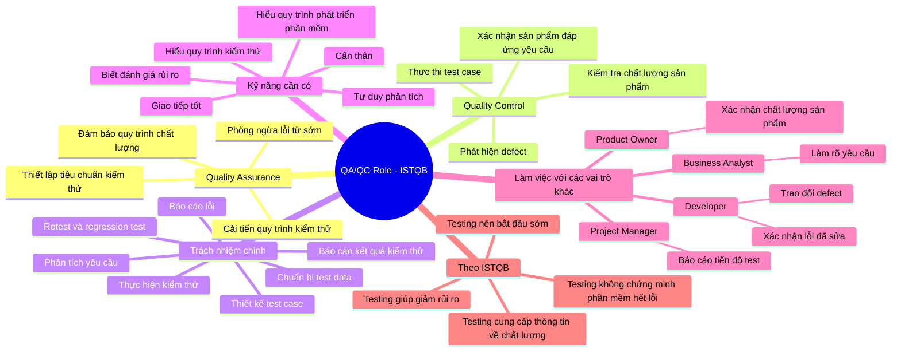

## AI Audit Report

> Ghi chú: Phần này chỉ audit các artifact đã hoàn chỉnh và không bị yêu cầu sửa tiếp. Các bản nháp hoặc bản đã bị phát hiện cần chỉnh sửa thêm không được đưa vào danh sách này.

---

### Audit Entry 01 – QA/QC Role ISTQB Mindmap bản rút gọn

#### (1) Prompt + tool

- **Tool:** GPT-5 / ChatGPT  
- **Timestamp:** 01:16 08/06/2026  
- **Prompt:**

```text
vì sao lại phức tạp như vậy, nó chỉ là role mindmap thôi mà
```

#### (2) AI output

```text
Đúng rồi, bản trước quá rộng vì mình đã trộn cả kiến thức ISTQB + kỹ thuật kiểm thử + tool + career path vào, trong khi yêu cầu của bạn chỉ là mindmap về role QA/QC theo ISTQB.

Bản hợp lý hơn nên tập trung vào vai trò, trách nhiệm, kỹ năng và hoạt động chính của QA/QC như sau:
```



```text
Bản này đúng hơn với yêu cầu “role mindmap” vì nó không đi quá sâu vào toàn bộ syllabus ISTQB.
```

#### (3) Verdict

**VALID**

Artifact đã sửa đúng theo phản hồi của sinh viên: tập trung vào vai trò QA/QC thay vì mở rộng sang toàn bộ kiến thức kiểm thử.

#### (4) Reasoning

Theo ISTQB CTFL, testing có mục tiêu cung cấp thông tin về chất lượng, giảm rủi ro và hỗ trợ ra quyết định. Mindmap đã thể hiện đúng các ý chính này trong phần “Theo ISTQB”. Nội dung cũng phân biệt tương đối rõ QA thiên về đảm bảo/cải tiến quy trình, còn QC thiên về kiểm tra sản phẩm, phát hiện defect và xác nhận sản phẩm đáp ứng yêu cầu.

#### (5) Student fix

Không cần sửa thêm. Artifact được giữ làm bản cuối.

**Điểm đã thay đổi so với bản đầu:**

```text
- Bỏ bớt phần quá rộng như toàn bộ test process, test level, test technique, tool và career path.
- Giữ trọng tâm vào QA/QC role.
- Thêm các nhóm dễ hiểu: Quality Assurance, Quality Control, Trách nhiệm chính, Kỹ năng cần có, Làm việc với vai trò khác, Theo ISTQB.
```

---

### Audit Entry 02 – Requirement 1 Prompt Log có timestamp

#### (1) Prompt + tool

- **Tool:** GPT-5 / ChatGPT  
- **Timestamp:** 03:15 07/06/2026  
- **Prompt:**

```text
hãy tạo một requirement1_prompt_log.md giúp tôi gồm nội dung của toàn bộ cuộc nói chuyện này và timestamp
```

#### (2) AI output

```text
AI tạo lại file requirement1_prompt_log.md, bổ sung timestamp, ghi chú về giới hạn timestamp, tóm tắt toàn bộ dữ liệu đầu vào, log từng lượt trao đổi, các file đã tạo, lỗi đã phát hiện và hướng sửa report cho đúng hơn.
```

Artifact được tạo:

```text
requirement1_prompt_log.md
```

Nội dung chính của artifact:

```text
- Ghi lại chủ đề Requirement 1 – QA/QC Job Market 2026+.
- Ghi thời điểm tạo log và múi giờ Asia/Ho_Chi_Minh.
- Tóm tắt bối cảnh Requirement 1.
- Ghi lại dữ liệu đầu vào gồm file report.md và 10 screenshot tuyển dụng.
- Ghi log các lượt trao đổi giữa user và AI.
- Ghi rõ lỗi AI đã tạo ra: một số phần mô tả công việc/kỹ năng đã được suy luận từ screenshot thay vì lấy từ nguồn xác minh.
- Đề xuất cách sửa report cho trung thực hơn.
- Liệt kê các file AI đã tạo trong quá trình làm Requirement 1.
```

#### (3) Verdict

**VALID**

Artifact phù hợp với mục đích prompt log vì ghi lại quá trình sử dụng AI, các file đã tạo, lỗi phát hiện và hướng sửa.

#### (4) Reasoning

Theo tinh thần minh bạch trong kiểm thử và báo cáo chất lượng, các kết quả do AI hỗ trợ cần có khả năng truy vết về prompt, output và các chỉnh sửa của sinh viên. File log này không chỉ ghi lại prompt mà còn ghi rõ phần AI đã suy luận quá mức, giúp người chấm biết phần nào cần được kiểm chứng. Điều này phù hợp với nguyên tắc kiểm thử cung cấp thông tin khách quan về chất lượng và rủi ro.

#### (5) Student fix

Không cần sửa thêm đối với file prompt log.

**Điểm cần giữ nguyên khi nộp:**

```text
- Giữ ghi chú về giới hạn timestamp.
- Giữ phần AI thừa nhận thông tin chưa xác minh.
- Giữ phần hướng sửa report dựa trên screenshot hoặc link gốc.
```

---

### Audit Entry 03 – Requirement 2 Markdown tiếng Việt: 20 lỗi phần mềm từ 2022–2026

#### (1) Prompt + tool

- **Tool:** GPT-5 / ChatGPT  
- **Timestamp:** 03:24 07/06/2026  
- **Prompt:**

```text
hiện tại report bị lẫn tiếng anh và tiếng việt, hãy chỉnh về tiếng việt
```

#### (2) AI output

```text
AI chỉnh trực tiếp file Markdown đã tạo trước đó:
- Việt hóa các nhãn như Description, Severity, Consequences, Solution.
- Đổi phần tổng kết và mô tả loại lỗi sang tiếng Việt hơn.
- Giữ nguyên các tên kỹ thuật/CVE/package cần thiết.
- Tạo file mới để không ghi đè file cũ.
```

Một số thay đổi chính:

```text
Description → Mô tả
Severity → Mức độ nghiêm trọng
Consequences → Hậu quả
Solution → Giải pháp khắc phục
AI bias/hallucination khi giải thích defect → Thiên kiến/ảo giác của AI khi giải thích lỗi
software defects → lỗi phần mềm
Source link → Link nguồn
```

Artifact được tạo:

```text
yeu_cau_2_20_loi_phan_mem_viet_hoa.md
```

#### (3) Verdict

**VALID**

Artifact đáp ứng yêu cầu chỉnh report về tiếng Việt, đồng thời vẫn giữ các thuật ngữ kỹ thuật cần thiết như CVE, GHSA, RCE, SQL Injection và prompt injection.

#### (4) Reasoning

Theo ISTQB, tài liệu kiểm thử và báo cáo cần rõ ràng, nhất quán và dễ hiểu với đối tượng đọc. Việc Việt hóa các nhãn chính giúp report thống nhất hơn, trong khi vẫn giữ thuật ngữ kỹ thuật để tránh làm sai nghĩa chuyên môn. Artifact này không bị yêu cầu sửa tiếp về mặt định dạng sau khi tạo file tiếng Việt.

#### (5) Student fix

Không cần sửa thêm về mặt ngôn ngữ.

**Điểm đã thay đổi:**

```text
- Đổi nhãn tiếng Anh sang tiếng Việt.
- Giữ thuật ngữ kỹ thuật quan trọng.
- Tạo file mới thay vì ghi đè file cũ.
```

---

### Audit Entry 04 – Requirement 2 Prompt Log có timestamp

#### (1) Prompt + tool

- **Tool:** GPT-5 / ChatGPT  
- **Timestamp:** 03:32 07/06/2026  
- **Prompt:**

```text
hãy tạo một requirement2_prompt_log.md giúp tôi gồm nội dung của toàn bộ cuộc nói chuyện này và timestamp
```

#### (2) AI output

```text
AI tạo lại file prompt log có timestamp.
File bao gồm:
- Thời điểm tạo log.
- Múi giờ Asia/Ho_Chi_Minh.
- Ghi chú rằng timestamp gốc chính xác của từng tin nhắn không được cung cấp trong giao diện.
- Các lượt hội thoại được đánh số Turn 01, Turn 02, ...
- Mỗi lượt có LoggedAt, Role, Mục đích và Nội dung.
```

Artifact được tạo:

```text
requirement2_prompt_log.md
```

#### (3) Verdict

**VALID**

Artifact ghi lại đầy đủ quá trình sử dụng AI cho Requirement 2, bao gồm prompt ban đầu, yêu cầu làm lại, yêu cầu xuất Markdown, yêu cầu Việt hóa, và các bước giải thích lỗi.

#### (4) Reasoning

Theo yêu cầu AI Audit Report, mỗi artifact cần có prompt, tool, output, verdict, reasoning và student fix. File prompt log hỗ trợ truy vết các artifact đã tạo và cho thấy quá trình sinh viên kiểm soát chất lượng output AI. Điều này phù hợp với tư duy ISTQB về testware và tính truy vết trong tài liệu kiểm thử.

#### (5) Student fix

Không cần sửa thêm.

**Điểm cần giữ nguyên khi nộp:**

```text
- Giữ timestamp tạo log.
- Giữ ghi chú rằng timestamp từng tin nhắn là LoggedAt.
- Giữ danh sách file đã tạo trong Requirement 2.
```

---

### Audit Entry 05 – Requirement 3 Markdown Test Cases cho tai nghe Rapoo VH520C

#### (1) Prompt + tool

- **Tool:** GPT-5 / ChatGPT  
- **Timestamp:** 01:16 08/06/2026  
- **Prompt:**

```text
tôi đang cần thực hiện test trên tai nghe rapoo vh520c. hãy viết cho tôi 10 test cases gồm các phần (Objective / Input / Steps / Expected / Actual / Verdict). hãy viết thành file md bắt đầu bằng tiêu đề ## Yêu cầu 3: Kiểm thử trên một sản phẩm vật lý
```

#### (2) AI output

```text
Assistant đã tạo file Markdown rapoo_vh520c_test_cases.md với tiêu đề:

## Yêu cầu 3: Kiểm thử trên một sản phẩm vật lý
```

Nội dung file gồm:

```text
- Thông tin sản phẩm kiểm thử: Tai nghe gaming Rapoo VH520C.
- Môi trường kiểm thử đề xuất: Laptop/PC Windows, cổng USB hoặc jack 3.5mm, phần mềm ghi âm, trình phát nhạc/video, ứng dụng gọi thoại.
- 10 test cases với các cột:
  - Test Case ID
  - Objective
  - Input
  - Steps
  - Expected
  - Actual
  - Verdict
```

Danh sách test case đã tạo:

```text
TC-01: Kiểm tra tình trạng vật lý bên ngoài của tai nghe trước khi sử dụng
TC-02: Kiểm tra tai nghe có kết nối được với máy tính hay không
TC-03: Kiểm tra khả năng phát âm thanh cơ bản của hai bên tai nghe
TC-04: Kiểm tra phân biệt kênh âm thanh trái/phải
TC-05: Kiểm tra bánh xe/nút điều chỉnh âm lượng trên tai nghe
TC-06: Kiểm tra micro ghi âm giọng nói
TC-07: Kiểm tra khả năng điều chỉnh hướng micro
TC-08: Kiểm tra đèn LED/RGB của tai nghe
TC-09: Kiểm tra độ ổn định khi dây/cổng kết nối bị dịch chuyển nhẹ
TC-10: Kiểm tra độ thoải mái khi đeo trong thời gian ngắn
```

Artifact được tạo:

```text
rapoo_vh520c_test_cases.md
```

#### (3) Verdict

**VALID**

Artifact đúng yêu cầu prompt vì tạo 10 test case cho sản phẩm vật lý và có đủ các trường Objective, Input, Steps, Expected, Actual, Verdict.

#### (4) Reasoning

Theo ISTQB, test case cần xác định mục tiêu kiểm thử, điều kiện/đầu vào, bước thực hiện và kết quả mong đợi để người kiểm thử có thể thực thi. Bộ test này bao phủ các khía cạnh chính của tai nghe: ngoại hình, kết nối, âm thanh, micro, điều khiển âm lượng, LED, dây/cổng kết nối và trải nghiệm đeo. Các trường Actual và Verdict được để lại để sinh viên điền sau khi thực hiện kiểm thử thực tế, điều này phù hợp với quá trình test execution.

#### (5) Student fix

Không cần sửa thêm ở giai đoạn test design.

**Khi thực thi thực tế, sinh viên cần điền thêm:**

```text
- Actual Result
- Verdict: Pass / Fail / Blocked
- Evidence: ảnh hoặc video nếu có
```

---

### Audit Entry 06 – Requirement 3 Excel Test Cases cho tai nghe Rapoo VH520C

#### (1) Prompt + tool

- **Tool:** GPT-5 / ChatGPT  
- **Timestamp:** 01:16 08/06/2026  
- **Prompt:**

```text
tạo cho tôi file excel chỉ chứa các test case đã được tạo ở trên
```

#### (2) AI output

```text
Assistant đã tạo file Excel gồm 1 sheet tên Test Cases, chứa đúng 10 test case đã tạo trước đó.
```

Các cột trong file Excel:

```text
- Test Case ID
- Objective
- Input
- Steps
- Expected
- Actual
- Verdict
```

Artifact được tạo:

```text
rapoo_vh520c_test_cases.xlsx
```

#### (3) Verdict

**VALID**

Artifact đúng yêu cầu vì chỉ chứa các test case đã tạo trước đó và được chuyển sang định dạng Excel để dễ nộp hoặc tổng hợp.

#### (4) Reasoning

Theo ISTQB, testware có thể bao gồm test cases, test data, test procedures và test execution results. Việc chuyển test case sang Excel không làm thay đổi logic kiểm thử, nhưng giúp quản lý và theo dõi test case dễ hơn. File có các cột cần thiết để phục vụ cả thiết kế test và ghi kết quả sau khi thực thi.

#### (5) Student fix

Không cần sửa thêm.

**Điểm cần lưu ý khi dùng file Excel:**

```text
- Nếu đã test thực tế, điền Actual và Verdict.
- Nếu có lỗi, có thể bổ sung thêm cột Defect ID hoặc Evidence.
```

---

### Audit Entry 07 – Requirement 3 Prompt Log có timestamp

#### (1) Prompt + tool

- **Tool:** GPT-5 / ChatGPT  
- **Timestamp:** 01:16 08/06/2026  
- **Prompt:**

```text
hãy tạo một requirement3_prompt_log.md giúp tôi gồm nội dung của toàn bộ cuộc nói chuyện này và timestamp
```

#### (2) AI output

```text
Assistant tạo file Markdown requirement3_prompt_log.md, ghi lại toàn bộ nội dung chính của cuộc trò chuyện liên quan đến Requirement 3, bao gồm:
- Prompt của người dùng.
- Tóm tắt phản hồi của assistant.
- Tên các artifact đã được tạo.
- Timestamp tạo log.
- Timezone sử dụng: Asia/Ho_Chi_Minh.
```

Artifact được tạo:

```text
requirement3_prompt_log.md
```

#### (3) Verdict

**VALID**

Artifact phù hợp với mục đích ghi lại quá trình sử dụng AI cho Requirement 3.

#### (4) Reasoning

Theo yêu cầu audit, mỗi artifact do AI tạo cần có prompt, tool, output và đánh giá lại bởi sinh viên. File prompt log giúp chứng minh test case và Excel được tạo từ prompt nào, vào thời điểm nào, và phục vụ yêu cầu nào. Điều này tăng tính truy vết và minh bạch của bài nộp.

#### (5) Student fix

Không cần sửa thêm.

**Điểm cần giữ nguyên khi nộp:**

```text
- Timestamp tạo log.
- Tên sản phẩm: Tai nghe Rapoo VH520C.
- Danh sách artifact đã tạo: Markdown test cases, Excel test cases, prompt log.
```

---

### Audit Entry 08 – Mindmap Prompt Log có timestamp

#### (1) Prompt + tool

- **Tool:** GPT-5 / ChatGPT  
- **Timestamp:** 01:16 08/06/2026  
- **Prompt:**

```text
hãy tạo một mindmap_prompt_log.md giúp tôi gồm nội dung của toàn bộ cuộc nói chuyện này và timestamp
```

#### (2) AI output

```text
Tạo file markdown ghi lại toàn bộ nội dung cuộc trò chuyện theo thứ tự, kèm timestamp tạo file.
```

Artifact được tạo:

```text
mindmap_prompt_log.md
```

Nội dung chính của artifact:

```text
- Tên file: mindmap_prompt_log.md
- Thời điểm tạo log: 2026-06-08 01:16:01 +07+0700
- Múi giờ: Asia/Ho_Chi_Minh
- Chủ đề: Tạo mindmap QA/QC Role theo ISTQB bằng Mermaid
- Ghi lại Prompt 01, Prompt 02, Prompt 03 theo đúng thứ tự trao đổi
- Bao gồm cả bản mindmap đầu và bản mindmap rút gọn sau khi sinh viên phản hồi
```

#### (3) Verdict

**VALID**

Artifact đáp ứng mục tiêu ghi lại quá trình tạo và chỉnh sửa mindmap bằng AI.

#### (4) Reasoning

Theo yêu cầu audit, việc ghi lại prompt và output giúp người chấm biết artifact cuối được tạo như thế nào và đã qua bước kiểm tra/chỉnh sửa nào. File log cho thấy bản đầu bị đánh giá là quá rộng, sau đó được sửa thành bản tập trung hơn vào role QA/QC. Điều này thể hiện sinh viên không dùng output AI một cách thụ động mà có kiểm tra và điều chỉnh.

#### (5) Student fix

Không cần sửa thêm.

**Điểm cần giữ nguyên khi nộp:**

```text
- Giữ cả bản đầu và bản đã sửa để thể hiện quá trình kiểm soát chất lượng AI output.
- Giữ timestamp tạo log.
- Giữ ghi chú về giới hạn timestamp từng tin nhắn.
```
