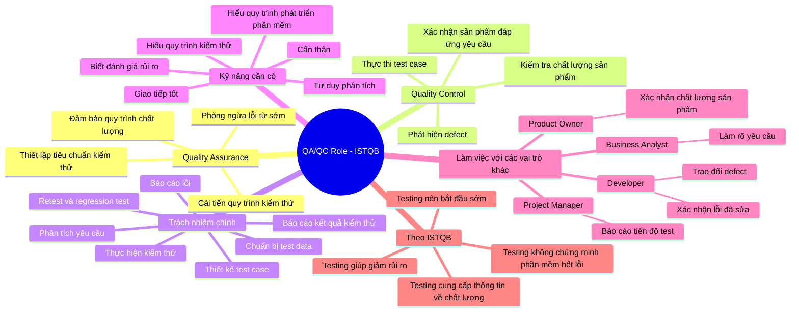

# mindmap_prompt_log.md

## Thông tin log

- **Tên file:** `mindmap_prompt_log.md`
- **Thời điểm tạo log:** `2026-06-08 01:16:01 +07+0700`
- **Múi giờ:** Asia/Ho_Chi_Minh
- **Chủ đề:** Tạo mindmap QA/QC Role theo ISTQB bằng Mermaid

> Ghi chú: Các mốc thời gian chi tiết của từng tin nhắn không được hệ thống cung cấp trực tiếp trong cuộc hội thoại này, vì vậy file log ghi lại nội dung theo đúng thứ tự trao đổi và dùng timestamp tạo file làm mốc thời gian tham chiếu.

---

## Prompt 01

**Timestamp tham chiếu:** `2026-06-08 01:16:01 +07+0700`

**User:**

```text
vẽ cho tôi một  QA/QC role ISTQB mindmap bằng mermaid
```

**Assistant:**

```text
Dưới đây là mindmap QA/QC Role theo ISTQB bằng Mermaid:
```

```mermaid
mindmap
  root((QA/QC Role - ISTQB))
    1. Vai trò QA/QC
      QA - Quality Assurance
        Đảm bảo quy trình phát triển phần mềm đúng chuẩn
        Thiết lập tiêu chuẩn chất lượng
        Cải tiến quy trình kiểm thử
        Phòng ngừa lỗi từ sớm
      QC - Quality Control
        Kiểm tra chất lượng sản phẩm
        Phát hiện lỗi phần mềm
        Thực hiện test case
        Báo cáo defect

    2. Kiến thức ISTQB nền tảng
      Testing là gì
        Đánh giá chất lượng phần mềm
        Tìm defect
        Giảm rủi ro
        Cung cấp thông tin cho quyết định release
      7 nguyên lý kiểm thử
        Testing shows presence of defects
        Exhaustive testing is impossible
        Early testing saves time and money
        Defects cluster together
        Pesticide paradox
        Testing is context dependent
        Absence-of-errors fallacy
      Test process
        Test planning
        Test monitoring and control
        Test analysis
        Test design
        Test implementation
        Test execution
        Test completion

    3. Kỹ năng chính của QA/QC
      Phân tích yêu cầu
        Hiểu business requirement
        Tìm điểm mơ hồ
        Xác định test condition
      Thiết kế test case
        Objective
        Input
        Steps
        Expected result
        Actual result
        Verdict
      Thực thi kiểm thử
        Manual testing
        Automation testing
        Regression testing
        Smoke testing
        Sanity testing
      Báo cáo lỗi
        Defect title
        Steps to reproduce
        Actual result
        Expected result
        Severity
        Priority
        Evidence screenshot/video

    4. Các cấp độ kiểm thử
      Component testing
        Kiểm thử từng module nhỏ
      Integration testing
        Kiểm thử tương tác giữa các module
      System testing
        Kiểm thử toàn bộ hệ thống
      Acceptance testing
        Kiểm thử theo nhu cầu người dùng

    5. Các loại kiểm thử
      Functional testing
        Kiểm thử chức năng
        Kiểm thử nghiệp vụ
        Kiểm thử UI/API
      Non-functional testing
        Performance testing
        Security testing
        Usability testing
        Compatibility testing
      Maintenance testing
        Regression testing
        Retesting
        Impact analysis

    6. Kỹ thuật thiết kế test
      Black-box techniques
        Equivalence Partitioning
        Boundary Value Analysis
        Decision Table Testing
        State Transition Testing
        Use Case Testing
      White-box techniques
        Statement Coverage
        Branch Coverage
        Path Testing
      Experience-based techniques
        Error Guessing
        Exploratory Testing
        Checklist-based Testing

    7. Defect Management
      Defect lifecycle
        New
        Assigned
        Open
        Fixed
        Retest
        Closed
        Reopened
      Severity
        Critical
        Major
        Minor
        Trivial
      Priority
        High
        Medium
        Low

    8. Công cụ hỗ trợ QA/QC
      Test management
        Jira
        TestRail
        Zephyr
      API testing
        Postman
        Swagger
      Automation testing
        Selenium
        Cypress
        Playwright
      Performance testing
        JMeter
        k6
      CI/CD
        Jenkins
        GitHub Actions
        GitLab CI

    9. Kỹ năng mềm
      Giao tiếp với Developer
      Làm rõ yêu cầu với BA/Product Owner
      Viết tài liệu rõ ràng
      Tư duy phản biện
      Cẩn thận và kiên nhẫn
      Tư duy theo rủi ro

    10. Định hướng nghề nghiệp
      Manual Tester
      Automation Tester
      QA Engineer
      QC Engineer
      Test Analyst
      Test Lead
      QA Manager
      SDET
```

---

## Prompt 02

**Timestamp tham chiếu:** `2026-06-08 01:16:01 +07+0700`

**User:**

```text
vì sao lại phức tạp như vậy, nó chỉ là role mindmap thôi mà
```

**Assistant:**

```text
Đúng rồi, bản trước quá rộng vì mình đã trộn cả kiến thức ISTQB + kỹ thuật kiểm thử + tool + career path vào, trong khi yêu cầu của bạn chỉ là mindmap về role QA/QC theo ISTQB.

Bản hợp lý hơn nên tập trung vào vai trò, trách nhiệm, kỹ năng và hoạt động chính của QA/QC như sau:
```



```text
Bản này đúng hơn với yêu cầu “role mindmap” vì nó không đi quá sâu vào toàn bộ syllabus ISTQB.
```

---

## Prompt 03

**Timestamp tham chiếu:** `2026-06-08 01:16:01 +07+0700`

**User:**

```text
hãy tạo một mindmap_prompt_log.md giúp tôi gồm nội dung của toàn bộ cuộc nói chuyện này và timestamp
```

**Assistant action:**

```text
Tạo file markdown ghi lại toàn bộ nội dung cuộc trò chuyện theo thứ tự, kèm timestamp tạo file.
```
