# Báo cáo HW01: Tin tuyển dụng QA/QC · 20 lỗi phần mềm · Kiểm thử sản phẩm vật lý

Mã số sinh viên: 23127296  
Họ tên: Nguyễn Thành Luân

## Yêu cầu 1: thị trường tuyển dụng QA/QC 2026+

### 1. Thông tin thu thập

- **Ngày thu thập:** `04/06/2026`
- **Tổng số tin tuyển dụng:** 10
- **Số tin có yêu cầu AI/LLM/automation-AI:** 6
- **Nguồn tìm kiếm:** TopCV, ITviec.

---

### 2. Chi tiết từng tin tuyển dụng

### Tin 1 – Automation Test Lead

| Trường thông tin | Nội dung |
|---|---|
| **Vị trí tuyển dụng** | Automation Test Lead |
| **Công ty** | Công ty TNHH Yopaz |
| **Nền tảng** | TopCV |
| **Địa điểm** | Nhật Bản, Hà Nội |
| **Ngày đăng** | 02/06/2026|
| **Ngày thu thập** | 04/06/2026 |
| **Liên kết nguồn** | (https://www.topcv.vn/viec-lam/automation-test-lead/2184494.html) |
| **Mức lương** | Tới 40 triệu |
| **Có yêu cầu AI/LLM?** | Có |

#### Ảnh chụp màn hình

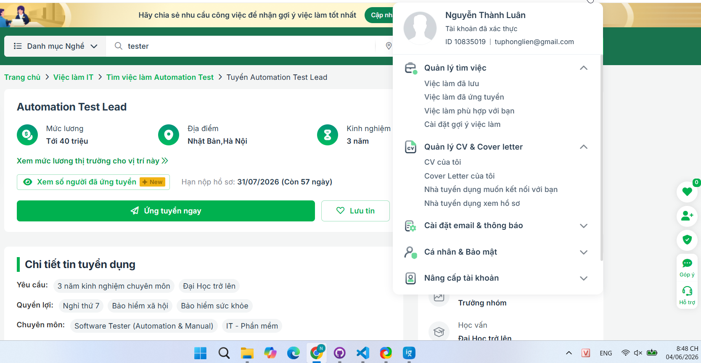

- **Ngày chụp màn hình:** 04/06/2026

#### Mô tả công việc

- Xây dựng chiến lược Automation Testing phù hợp với từng dự án và từng giai đoạn phát triển sản phẩm.
Thiết kế và chuẩn hóa quy trình Automation Testing trong công ty.
- Thiết kế, phát triển và duy trì Automation Framework cho Web, API và Mobile Testing.
- Xây dựng và quản lý bộ Regression Test tự động.
- Tích hợp Automation Testing vào quy trình CI/CD.
- Theo dõi các chỉ số chất lượng như Automation Coverage, Test Coverage, Defect Leakage và Test Execution Result.
- Làm việc với PM, BrSE, Developer và QA để đảm bảo chất lượng sản phẩm.
- Nghiên cứu và ứng dụng AI vào hoạt động kiểm thử.
- Đào tạo, mentoring và phát triển đội ngũ QA/Automation QA.

#### Kỹ năng yêu cầu

- Tối thiểu 5 năm kinh nghiệm Software Testing.
- Tối thiểu 3 năm kinh nghiệm Automation Testing.
- Có kinh nghiệm xây dựng hoặc maintain Automation Framework.
- Thành thạo Playwright, Selenium, Cypress, Appium hoặc Robot Framework.
- Có kinh nghiệm kiểm thử Web Application và API Testing.
- Thành thạo JavaScript/TypeScript, Java, Python hoặc C#.
- Hiểu rõ SDLC, STLC và Agile/Scrum.
- Có kinh nghiệm Git, SQL, REST API và CI/CD.
- Ưu tiên ứng viên có kinh nghiệm khách hàng Nhật Bản và khả năng tiếng Nhật.
- Tư duy logic và khả năng phân tích tốt.
- Kỹ năng giao tiếp, teamwork và leadership tốt.
- Khả năng đào tạo và phát triển thành viên.
- Chủ động và liên tục cải tiến quy trình.

#### Phân tích tác động của AI

Tin này có yêu cầu sử dụng AI vào việc kiểm thử. Đó có thể là yêu cầu AI tạo các thiết kế các test case cơ bản, đề xuất tool.

---

### Tin 2 – Chuyên Viên QC Phần Mềm (QC Executive)

| Trường thông tin | Nội dung |
|---|---|
| **Vị trí tuyển dụng** | Chuyên Viên QC Phần Mềm (QC Executive) |
| **Công ty** | Kingfoodmart |
| **Nền tảng** | ITviec |
| **Địa điểm** | 571 Huynh Tan Phat, Tan Thuan Dong Ward, Tân Thuận, TP Hồ Chí Minh |
| **Ngày đăng** | 27/05/2026 |
| **Ngày thu thập** | 04/06/2026 |
| **Liên kết nguồn** | (https://itviec.com/viec-lam-it/chuyen-vien-qc-phan-mem-qc-executive-kingfoodmart-0249) |
| **Mức lương** | 950 - 1,400 USD |
| **Có yêu cầu AI/LLM?** | Không |

#### Ảnh chụp màn hình

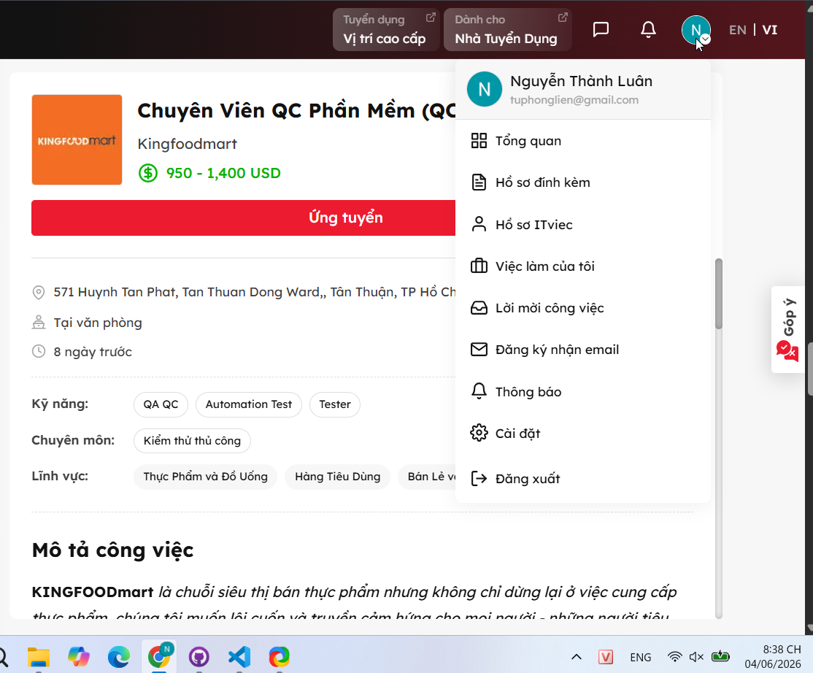

- **Ngày chụp màn hình:** 04/06/2026

#### Mô tả công việc

- Lập kế hoạch kiểm tra, chuẩn bị test case chi tiết và tiến hành kiểm thử phần mềm đã được phát triển
- Thực hiện kiểm tra, log lỗi và theo dõi tiến độ fix bug của team phát triển
- Quản lý, giám sát và theo dõi vòng đời các vấn đề lỗi có thể phát sinh trong hệ thống
- Kiểm soát chất lượng đảm bảo hệ thống/sản phẩm được tạo đúng như thiết kế đã thống nhất
- Phối hợp chặt chẽ nhóm kỹ thuật (backend, web & mobile) để đảm bảo chất lượng sản phẩm đồng đều
- Phối hợp với nhóm phát triển sản phẩm (product design) để hoàn thiện các tài liệu yêu cầu phát triển chi tiết
- Chủ động hoàn thành công việc được giao với mức độ giám sát tối thiểu

#### Kỹ năng yêu cầu

- Có kinh nghiệm thực tế trong việc kiểm thử các hệ thống ERP (hoặc các hệ thống quản trị doanh nghiệp phức tạp tương đương).
- Kỹ năng phân tích logic tốt, có khả năng dự đoán các tình huống, kịch bản (Edge cases) có thể gây lỗi hệ thống.
- Nắm vững các kiến thức, quy trình và kỹ thuật kiểm thử phần mềm (Functional, Regression, Integration, API Testing,...).
- Biết sử dụng các công cụ AI tối ưu hóa việc viết test case, tạo dữ liệu mẫu (mock data) hoặc hỗ trợ viết script test.
- Kỹ năng viết bug, rõ ràng, lắng nghe và truyền đạt thông tin hiệu quả giữa các bên (Dev, Product, QA).
- Chủ động cập nhật các xu hướng công nghệ, công cụ và quy trình kiểm thử mới để nâng cao hiệu suất công việc.
- Có kinh nghiệm hoặc khả năng viết kịch bản kiểm thử tự động (Automation Test) sử dụng TypeScript với các công cụ Playwright (cho Web) và Appium (cho Mobile) là một lợi thế lớn.
- Kỹ năng học hỏi nhanh và chủ động cập nhật các xu hướng công nghệ.

#### Phân tích tác động của AI

Tin này không yêu cầu tới khả năng sử dụng AI. Tuy nhiên nếu tester vẫn có thể sử dụng AI cho việc tạo test case cơ bản và hỗ trợ viết báo cáo.

---

### Tin 3 – Tester (Sub-leader) (tiếng Nhật N2)

| Trường thông tin | Nội dung |
|---|---|
| **Vị trí tuyển dụng** | Tester (Sub-leader) (tiếng Nhật N2) |
| **Công ty** | DTS Software Vietnam |
| **Nền tảng** | ITviec |
| **Địa điểm** | Tầng 3, 266 Đội Cấn, phường Ngọc Hà, Hà Nội |
| **Ngày đăng** | 01/06/2026 |
| **Ngày thu thập** | 04/06/2026 |
| **Liên kết nguồn** | (https://itviec.com/it-jobs/tester-sub-leader-tieng-nhat-n2-dts-software-vietnam-4240) |
| **Mức lương** | 1,000 - 2,000 USD |
| **Có yêu cầu AI/LLM?** | Không |

#### Ảnh chụp màn hình

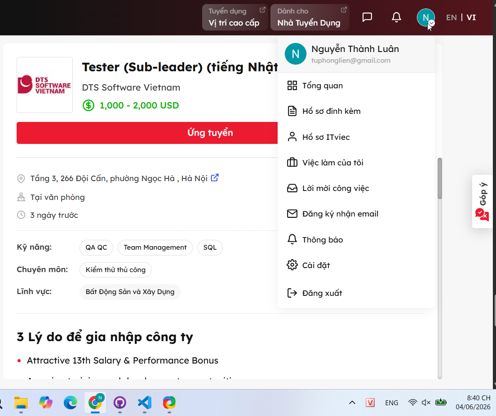

- **Ngày chụp màn hình:** 04/06/2026

#### Mô tả công việc
- Viết testcase và thực hiện kiểm thử dựa trên tài liệu đặc tả bằng tiếng Nhật
- Làm việc với khách hàng để trao đổi, làm rõ yêu cầu
- Nghiệp vụ: phát triển ứng dụng CAD liên quan đến thiết kế bản vẽ kiến trúc cho khách hàng Nhật
- Hỡ trợ quản lý tiến độ công việc của team
- Có cơ hội tham gia một số dự án thuộc lĩnh vực khác: tài chính, ngân hàng, bảo hiểm,…

#### Kỹ năng yêu cầu
- Có trên 3 năm kinh nghiệm làm việc tại vị trí Tester và đã có thời gian viết testcase bằng tiếng Nhật
- Trình độ tiếng Nhật tương đương N2 trở lên và có khả năng giao tiếp trực tiếp bằng tiếng Nhật
- Có kinh nghiệm quản lý và báo cáo lỗi
- Có khả năng trao đổi và phối hợp tốt với khách hàng
- Ưu tiên có kinh nghiệm quản lý team từ 2-3 members
- Ưu tiên có kiến thức hoặc đã từng có kinh nghiệm liên quan đến các dự án về CAD/ Kiến trúc/ Bản vẽ.

#### Phân tích tác động của AI

Tin này không yêu cầu tới khả năng sử dụng AI. Nhưng tester vẫn có thể dùng AI để hỗ trợ thiết kế test case và đặc biệt là viết tài liệu bằng tiếng Nhật.

---

### Tin 4 – Manual Tester (Fresher/Junior)

| Trường thông tin | Nội dung |
|---|---|
| **Vị trí tuyển dụng** | Manual Tester (Fresher/Junior) |
| **Công ty** | MediaX |
| **Nền tảng** | ITviec |
| **Địa điểm** | 5th floor V1 The Terra An Hung, Dương Nội, Hà Nội |
| **Ngày đăng** | 21/05/2026 |
| **Ngày thu thập** | 04/06/2026 |
| **Liên kết nguồn** | (https://itviec.com/viec-lam-it/manual-tester-fresher-junior-mediax-3442) |
| **Mức lương** | 7m - 15m |
| **Có yêu cầu AI/LLM?** | Có |

#### Ảnh chụp màn hình

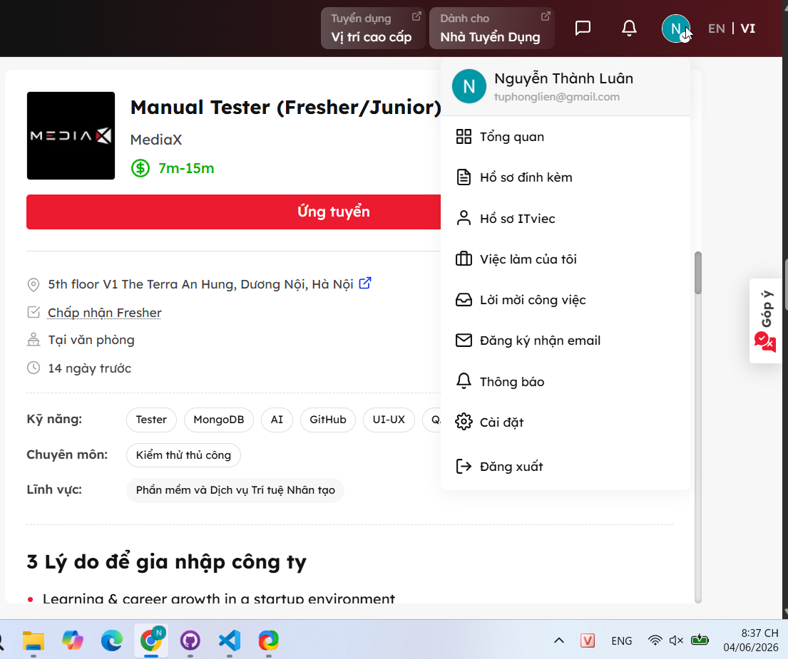

- **Ngày chụp màn hình:** 04/06/2026

#### Mô tả công việc

- Đọc hiểu requirement, business flow và luồng nghiệp vụ của hệ thống
- Tham gia review requirement cùng team để phát hiện rủi ro từ sớm
- Thiết kế checklist, test case, test scenario
- Thực hiện manual testing cho các tính năng trên Website, App, CMS, Admin System và AI Product
- Kiểm thử functional flow, UI/UX, permission, role, data validation, upload, import, export
- Kiểm thử responsive, cross-browser, user flow và dashboard flow
- Kiểm thử AI Chat, AI Agent flow theo kịch bản người dùng
- Thực hiện smoke testing, regression testing, UI testing, functional testing
- Log bug rõ ràng, đủ thông tin, giúp Dev dễ reproduce và fix
- Theo dõi, retest và verify bug sau khi Dev xử lý
- Kiểm tra chất lượng sản phẩm trước khi release
- Chủ động phát hiện vấn đề ảnh hưởng đến trải nghiệm người dùng
- Phối hợp với Dev, PM để đảm bảo tiến độ và chất lượng dự án
- Báo cáo tiến độ testing, tình trạng bug và rủi ro phát sinh

#### Kỹ năng yêu cầu
- Có kinh nghiệm Manual Tester, QA hoặc QC từ 6 tháng trở lên
- Hiểu cơ bản về quy trình phát triển phần mềm
- Có tư duy logic, kỹ năng phân tích và xử lý vấn đề
- Có kinh nghiệm viết test case, checklist, log bug
- Có kinh nghiệm regression testing và UI testing
- Đọc hiểu requirement và mô tả nghiệp vụ tốt
- Cẩn thận, có trách nhiệm, chú ý đến chi tiết
- Biết sử dụng Jira, Trello hoặc Notion
- Biết sử dụng Google Sheet, Google Docs
- Biết dùng DevTools ở mức cơ bản
#### Phân tích tác động của AI

Tin này liên quan trực tiếp đến kiểm thử sản phẩm AI như AI Assistant và AI Agent. Có nghĩa có thể tester không chỉ cần kỹ năng sử dụng AI mà cần phải có kiến thức về AI để có thể thực hiện kiểm thử trên AI.

---

### Tin 5 – Software QA Engineer (AI-first mindset)

| Trường thông tin | Nội dung |
|---|---|
| **Vị trí tuyển dụng** | Software QA Engineer (AI-first mindset) |
| **Công ty** | Zen8Labs |
| **Nền tảng** | ITviec |
| **Địa điểm** | TT03A-13, Mo Lao New Urban, Hà Đông, Hà Nội |
| **Ngày đăng** | 29/05/2026 |
| **Ngày thu thập** | 04/06/2026 |
| **Liên kết nguồn** | (https://itviec.com/it-jobs/software-qa-engineer-ai-first-mindset-zen8labs-5907) |
| **Mức lương** | Tối đa 2,000 USD |
| **Có yêu cầu AI/LLM?** | Có |

#### Ảnh chụp màn hình

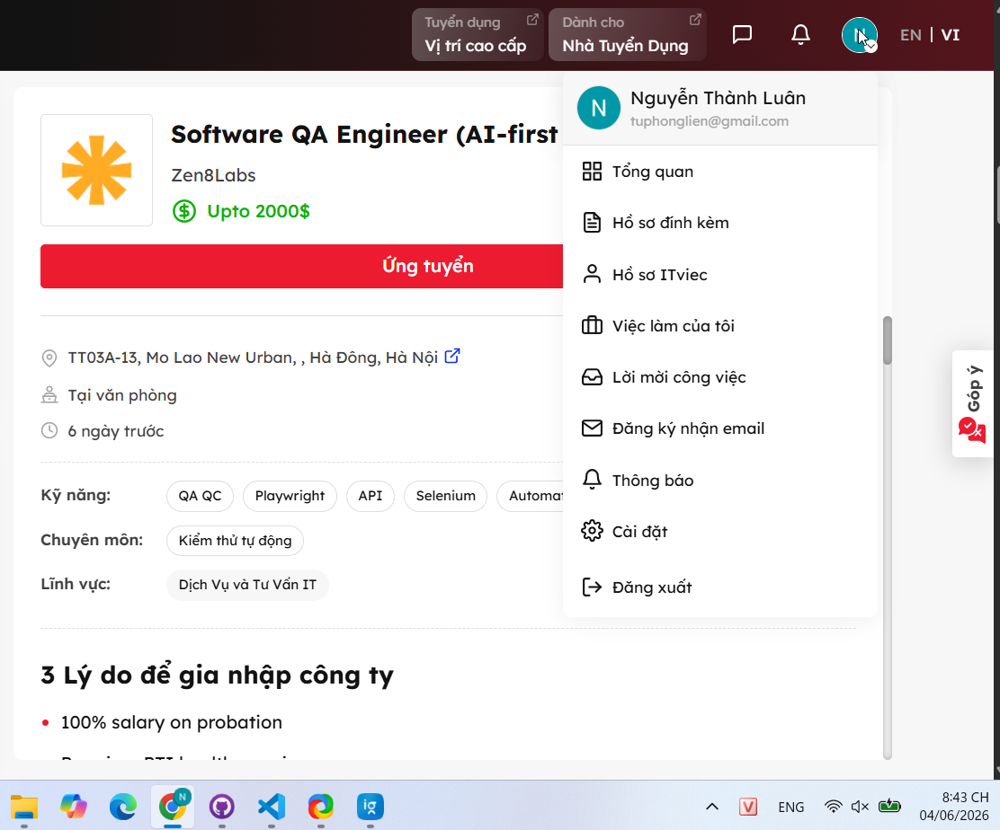

- **Ngày chụp màn hình:** 04/06/2026

#### Mô tả công việc

- Perform hands-on manual and exploration testing for complex workflows, integrations, edge cases, and production-like scenarios.
- Apply AI/Agentic AI tools to assist in generating, validating, maintaining, and optimizing test plans, test cases, and regression suites.
- Review and validate AI-generated test scenarios, automation scripts, and testing outcomes to ensure accuracy, completeness, and business relevance.
- Leverage AI-assisted workflows to improve defect analysis, root-cause investigation, and test coverage efficiency.
- Validate functionality across frontend, backend, APIs, databases, integrations, and system-level components.
- Collaborate closely with developers, DevOps engineers, product owners, and system engineers to ensure product quality and stability.
- Investigate defects thoroughly and use both traditional and AI-assisted approaches to identify root causes and quality risks.
- Develop and maintain automated test scripts/frameworks for regression, smoke, API, and integration testing.
- Continuously identify repetitive manual testing activities and transform them into scalable automated or AI-assisted testing workflows.
- Support CI/CD pipelines and integrate automated testing into deployment workflows.
- Participate in performance, reliability, stress, and scalability testing activities.
- Evaluate and experiment with emerging AI testing tools, AI agents, and QA productivity solutions to improve engineering efficiency.
- Monitor testing metrics, defect trends, and release quality indicators using datadriven approaches.
- Continuously improve QA processes, testing strategies, and AI-driven quality engineering practices

#### Kỹ năng yêu cầu

- 4+ years of experience in software testing with strong manual testing expertise.
- Experience testing complex, distributed, or high-traffic applications/systems.
- Strong understanding of end-to-end testing, integration testing, regression testing, and exploratory testing.
- Hands-on experience with automation testing tools/frameworks such as Selenium, Playwright, Cypress, Robot Framework, or similar.
- Ability to write and maintain automation scripts using JavaScript, Java, Python, or similar languages.
- Experience with API testing and backend validation.
- Familiarity with Agile/Scrum methodologies and CI/CD environments.
- Strong interest in applying AI/LLM/Agentic AI tools to improve software testing and QAworkflows.
- Experience using AI-assisted development/testing tools such as Cursor, Claude, GitHub Copilot, ChatGPT, or similar platforms is highly preferred.
- Experience with test management and defect tracking tools such as Jira, qTest, Xray, or TestRail.
- Strong analytical thinking, troubleshooting, and communication skills.
- Ability to work independently in fast-paced and complex environments

#### Phân tích tác động của AI

Tin này yêu cầu phải có mindset AI-first. Có nghĩa phải cố gắng tận dụng AI trong mọi bước của quy trình kiểm thử.

---

### Tin 6 – QA Team Lead

| Trường thông tin | Nội dung |
|---|---|
| **Vị trí tuyển dụng** | QA Team Lead |
| **Công ty** | Nakivo |
| **Nền tảng** | ITviec |
| **Địa điểm** | TGI Building, 208 Nguyen Trai, TP Hồ Chí Minh |
| **Ngày đăng** | 04/06/2026 |
| **Ngày thu thập** | 04/06/2026 |
| **Liên kết nguồn** | (https://itviec.com/it-jobs/qa-team-lead-nakivo-3715) |
| **Mức lương** | 2,500 - 3,000 USD |
| **Có yêu cầu AI/LLM?** | Có |

#### Ảnh chụp màn hình

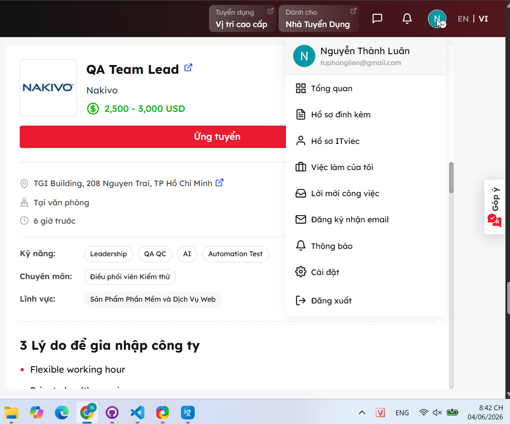

- **Ngày chụp màn hình:** 04/06/2026

#### Mô tả công việc

##### 1. Quality Ownership
- Own release quality for your product/team
- Define testing scope based on risk, timelines, and business priorities
- Ensure only production-ready features are released
- Participate actively in planning, requirement reviews, and release discussions
- Identify quality risks early and drive mitigation plans

##### 2. Team Leadership
- Lead and mentor QA engineers across manual and automation testing
- Create a strong culture of accountability, ownership, and continuous improvement
- Improve team efficiency and execution quality

##### 3. Testing & Automation
- Define and improve regression strategies
- Drive automation for UI, API, and integration testing
- Improve CI/CD quality workflows and release confidence
- Optimize test execution time while maintaining meaningful coverage
- Support exploratory, risk-based, and customer-focused testing approaches

##### 4. Customer & Product Focus
- Work closely with Product, DEV, and Support teams
- Analyze production defects and customer feedback to improve test coverage
- Drive root-cause analysis and defect prevention practices
- Focus on customer-perceived quality, not only internal QA metrics

##### 5. Process & Continuous Improvement
- Help establish practical QA processes that teams actually follow
- Track quality KPIs and testing effectiveness
- Improve release readiness, test planning, and defect management
- Introduce AI-assisted QA workflows where they provide real value
#### Kỹ năng yêu cầu

- 6+ years of experience in software testing / quality engineering
- 3+ years leading QA teams or acting as QA Lead
- Strong hands-on experience with:
    - Test automation
    - Designing test matrices across multiple OS versions, hardware configurations, and storage targets
    - Regression strategy
- Experience reviewing requirements and identifying testing risks early
- Strong troubleshooting and analytical skills
- Experience mentoring junior and mid-level QA engineers
- Comfortable working in fast-moving environments with evolving priorities
- Good communication skills in English
- Hands-on testing experience with backup/recovery products
- Experience with cloud platforms, backup/storage products, virtualization, or infrastructure-related software
- Experience improving release quality and reducing defect leakage
- Experience using AI tools (ChatGPT, Copilot, Cursor, Claude, etc.) to improve QA workflows
- Experience building automation frameworks or improving testing architecture

#### Phân tích tác động của AI

Tin này yêu cầu sử dụng AI trong QA workflow. Tester phải sử dụng AI trong workflow như hỗ trợ thiết kế test plan, test case,.. và yêu cầu việc sử dụng phải tạo ra hiệu năng thật.

---

### Tin 7 – Chuyên Viên Kiểm Thử Phần Mềm

| Trường thông tin | Nội dung |
|---|---|
| **Vị trí tuyển dụng** | Chuyên Viên Kiểm Thử Phần Mềm |
| **Công ty** | CÔNG TY CỔ PHẦN CÔNG NGHỆ AIT |
| **Nền tảng** | TopCV |
| **Địa điểm** | Hà Nội |
| **Ngày đăng** | 04/06/2026 |
| **Ngày thu thập** | 04/06/2026 |
| **Liên kết nguồn** | (https://www.topcv.vn/viec-lam/chuyen-vien-kiem-thu-phan-mem/2172054.html) |
| **Mức lương** | 15 - 25 triệu |
| **Có yêu cầu AI/LLM?** | Không |

#### Ảnh chụp màn hình

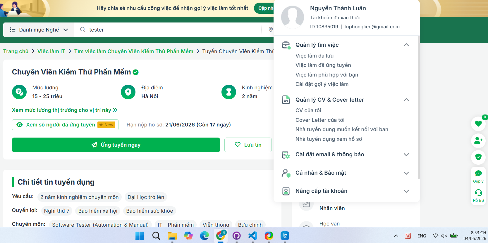

- **Ngày chụp màn hình:** 04/06/2026

#### Mô tả công việc

- Tham gia tìm hiểu và phân tích yêu cầu hệ thống phần mềm của dự án lĩnh vực Bưu chính, logistic, Fintech, Doanh nghiệp, …
- Phối hợp BA phân tích, làm rõ yêu cầu và thiết kế yêu cầu
- Thiết kế kế hoạch test, kịch bản test, test script, test data
- Tạo dữ liệu kiểm thử, thiết lập môi trường kiểm thử
- Thực hiện test theo kế hoạch và kịch bản test
- Tiếp nhận và kiểm tra các lỗi được phản ánh
- Viết báo cáo test, đánh giá kết quả kiểm thử
- Kiểm soát việc sửa lỗi của đội lập trình để đảm bảo tiến độ & phần mềm đạt chất lượng cao.

#### Kỹ năng yêu cầu

- Tốt nghiệp ĐH chuyên ngành CNTT, Hệ thống quản lý thông tin, Điện tử viễn thông, các chuyên ngành tương đương.
- Có thể đi onsite tùy thời điểm và tình hình dự án
- Tối thiểu >1.5 năm làm việc thực tế tại các công ty, dự án về vị trí kiểm thử phần mềm;
- Có kiến thức sâu rộng về quy trình kiểm thử phần mềm, phương pháp, công cụ test và kỹ thuật test
- Có kinh nghiệm kiểm thử App/Web
- Ưu tiên có kiến thức SQL
- Ưu tiên có kinh nghiệm API Testing dự án thực tế
- Ưu tiên nhân sự có khả năng làm việc độc lập, key member của dự án

#### Phân tích tác động của AI

Tin này chưa yêu cầu AI. Nhưng tester có thể sử dụng AI hỗ trợ thiết kế test case, viết báo cáo,..

---

### Tin 8 – Manual Tester - 13T LƯƠNG

| Trường thông tin | Nội dung |
|---|---|
| **Vị trí tuyển dụng** | Manual Tester - 13T LƯƠNG |
| **Công ty** | Viettel Post (A Member of Viettel Group) |
| **Nền tảng** | ITviec |
| **Địa điểm** | Số 2, ngõ 15, Duy Tân, Cầu Giấy, Hà Nội |
| **Ngày đăng** | 24/05/2026= |
| **Ngày thu thập** | 04/06/2026 |
| **Liên kết nguồn** | =(https://itviec.com/viec-lam-it/manual-tester-13t-luong-viettel-post-a-member-of-viettel-group-3726) |
| **Mức lương** | 800 - 2,000 USD |
| **Có yêu cầu AI/LLM?** | Không |

#### Ảnh chụp màn hình

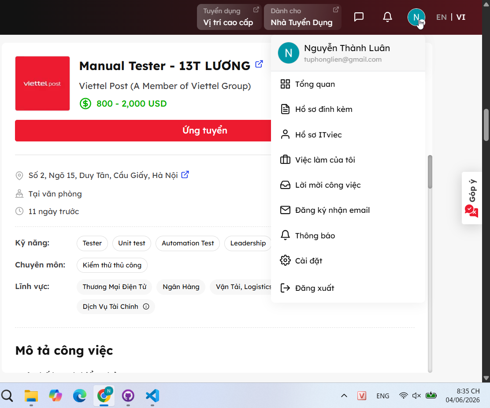

- **Ngày chụp màn hình:** 04/06/2026

#### Mô tả công việc

- Lập kế hoạch kiểm thử
- Nghiên cứu, phân tích và review các tài liệu yêu cầu, thiết kế
- Thiết kế Test case, checklist
- Thực hiện kiểm thử (chức năng, hiệu năng, bảo mật)
- Log lỗi và quản lý lỗi trên hệ thống Quản lý lỗi
- Giám sát, đo lường, quản lý và báo cáo về quá trình kiểm thử, chất lượng phần mềm, kết quả kiểm thử.
- Phối hợp với dự án để thực hiện kiểm thử nghiệm thu cùng khách hàng.
- Tham gia đánh giá và cải tiến quy trình, hệ thống đảm bảo chất lượng
- Tổ chức phân tích, đánh giá, tự lên phương án nâng cao hiệu quả, hiệu suất các quy trình triển khai testing của bộ phận.
- Phân bổ công việc trong nhóm test, review testcase và chất lượng test của tester (Áp dụng cho vị trí Test Lead)
- Đào tạo và hướng dẫn các bạn tester trong dự án (Áp dụng cho vị trí Test Lead)

#### Kỹ năng yêu cầu

##### Yêu cầu chung & Học vấn
- Tốt nghiệp Đại học trở lên chuyên ngành Công nghệ thông tin hoặc tương đương.
- Nắm vững các quy trình và kỹ thuật test.
- Có kỹ năng lập kế hoạch, kỹ năng phân tích nghiệp vụ.
- Có kỹ năng xây dựng test case và thực hiện test.
- Có kỹ năng phân tích kết quả kiểm thử và báo cáo.
- Có kinh nghiệm làm việc với các dự án theo quy trình CMMI, Agile/Scrum.
- Thành thạo SQL.
- Có kỹ năng làm việc nhóm.
- Có khả năng đọc hiểu tài liệu tiếng Anh tốt.
- Yêu thích các sản phẩm mà mình làm ra, đưa ra các đóng góp cải tiến để sản phẩm tốt hơn.

##### Yêu cầu theo Level
- Level Senior, Leader: Có tối thiểu 5 năm kinh nghiệm trở lên với vị trí kiểm thử phần mềm bao gồm cả test Web, Mobile và Backend (SQL DB) và tối thiểu 2 năm kinh nghiệm test lead cho product, quản lý team từ 5 người trở lên. Trên 10 người là lợi thế.
- Level Junior: Có tối thiểu 2 năm kinh nghiệm trở lên với vị trí kiểm thử phần mềm

##### Điểm cộng / Ưu tiên
- Ưu tiên ứng viên có kinh nghiệm làm các domain về Tài Chính/Ngân hàng/Dữ liệu lớn/Logistics
- Có chứng chỉ ISTQB (Áp dụng cho Test Leader)
- Có kinh nghiệm sử dụng các phần mềm về Test hiệu năng (Jmeter), automation test.

#### Phân tích tác động của AI

Tin này không yêu cầu AI. Tuy nhiên tester có thể sử dụng AI hỗ trợ cho việc sinh test case và dữ liệu kiểm thử, nhưng phải đảm bảo tính bảo mật vì liên quan đến dịch vụ tài chính.

---

### Tin 9 – Senior QA Engineer (Tester/Business Analyst)

| Trường thông tin | Nội dung |
|---|---|
| **Vị trí tuyển dụng** | Senior QA Engineer (Tester/Business Analyst) |
| **Công ty** | soxes AG |
| **Nền tảng** | ITviec |
| **Địa điểm** | Estar Building, 147-149 Vo Van Tan St., Xuân Hòa, TP Hồ Chí Minh |
| **Ngày đăng** | 21/05/2026 |
| **Ngày thu thập** | 04/06/2026 |
| **Liên kết nguồn** | (https://itviec.com/viec-lam-it/senior-qa-engineer-tester-business-analyst-soxes-ag-3239) |
| **Mức lương** | 1,800 - 2,200 USD |
| **Có yêu cầu AI/LLM?** | Có |

#### Ảnh chụp màn hình

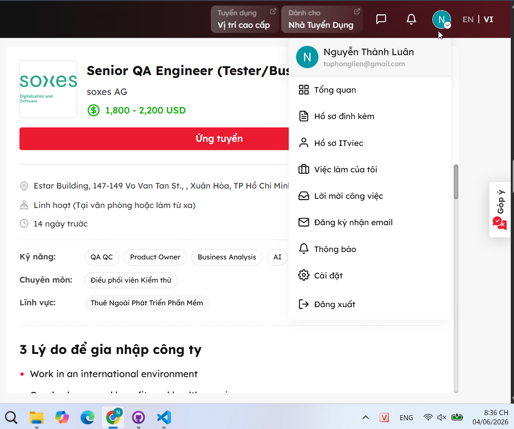

- **Ngày chụp màn hình:** 04/06/2026

#### Mô tả công việc

##### Job Overview
- We are seeking an experienced and detail-oriented Senior Testing Engineer to ensure the quality, stability, and performance of our software products.
- The ideal candidate should have strong expertise in manual testing and requirement analysis, along with basic hands-on experience using AI-assisted tools to improve testing efficiency and software quality processes.

##### Key Responsibilities
- Technical Responsibilities
- Analyze business and system requirements to ensure completeness and testability.
- Collaborate with Product Owners, Business Analysts, and Developers to clarify requirements and expected behaviors.
- Design, develop, execute, and maintain test plans, test cases, and testing documentation.
- Perform functional, regression, integration, system, API, and performance testing.
- Identify, document, track, and verify software defects.
- Ensure software quality, reliability, scalability, and security standards are met.
- Participate in release validation and production verification activities.
- Utilize AI-assisted tools to improve QA productivity and testing efficiency.
- Apply AI tools for:
    - Test case generation
    - Defect analysis
    - Test data preparation
    - Documentation support
- Work with AI-assisted tools such as:
    - ChatGPT
    - GitHub Copilot
    - AI-based testing support tools
- Provide recommendations for continuous improvement in QA processes and product quality.
#### Kỹ năng yêu cầu

##### Experience & Skills
- Minimum 5+ years of experience in software testing and quality assurance.
- Strong experience in manual testing and requirement analysis.
- Basic knowledge or experience with automation testing is a plus.
- Experience using AI-assisted tools in software testing or daily work activities is preferred.
- Familiarity with:
    - RESTful APIs
    - CI/CD pipelines
    - Git version control
    - Cloud platforms

##### Education
- Bachelor’s degree in Computer Science, Information Technology, or a related technical field.

##### Language Skills
- Strong English communication skills, with the ability to work effectively in an international environment and collaborate directly with overseas partners.

#### Phân tích tác động của AI

Tin này có yêu cầu sử dụng AI, cụ thể là sử dụng các LLM hoặc AI-based testing tools để tạo test case, test data và phân tích defect.

---

### Tin 10 – Senior QC (Automation Tester, QA QC)

| Trường thông tin | Nội dung |
|---|---|
| **Vị trí tuyển dụng** | Senior QC (Automation Tester, QA QC) |
| **Công ty** | PNJ |
| **Nền tảng** | ITviec |
| **Địa điểm** | 170 Phan Đăng Lưu, Phường Đức Nhuận, TP Hồ Chí Minh |
| **Ngày đăng** | 20/05/2026 |
| **Ngày thu thập** | 04/06/2026 |
| **Liên kết nguồn** | (https://itviec.com/viec-lam-it/senior-qc-automation-tester-qa-qc-pnj-5542) |
| **Mức lương** | 1,000 - 1,500 USD |
| **Có yêu cầu AI/LLM?** | Có |

#### Ảnh chụp màn hình

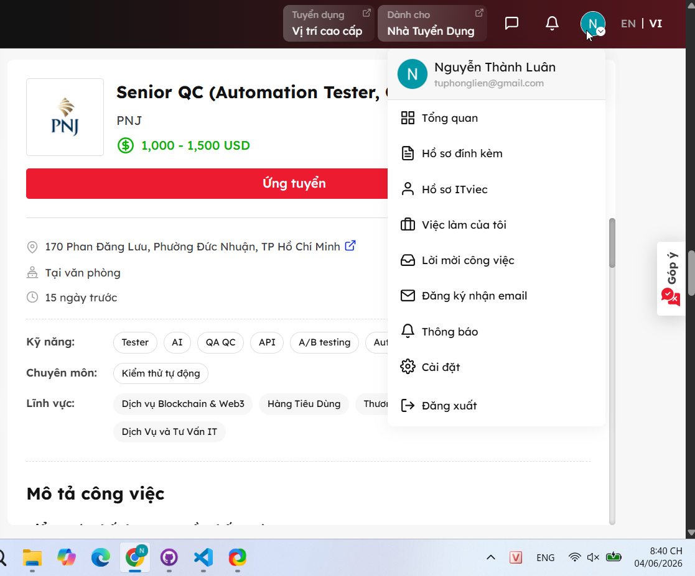

- **Ngày chụp màn hình:** 04/06/2026

#### Mô tả công việc

##### Kiểm soát chất lượng truyền thống và AI
- Phân tích và review các đặc tả yêu cầu chức năng
- Lập kế hoạch kiểm thử cho các sản phẩm truyền thống và AI
- Thực hiện kiểm thử chức năng, UI/UX và hành vi của AI
- Kiểm tra các tình huống edge case, misuse và rủi ro nghiệp vụ
- Kiểm tra độ chính xác, độ tin cậy và tính công bằng của kết quả AI
- Theo dõi và báo cáo các lỗi một cách có hệ thống
- Tham gia các buổi demo và review luồng nghiệp vụ

##### Kiểm thử tự động và công cụ AI
- Phát triển các kịch bản kiểm thử tự động
- Áp dụng các công cụ kiểm thử AI (LLM evaluation, synthetic data)
- Thiết lập và duy trì hệ thống CI/CD cho kiểm thử
- Sử dụng công cụ giả lập người dùng để kiểm thử tự động
- Phát triển các công cụ nội bộ hỗ trợ kiểm thử AI 

##### Đảm bảo chất lượng dữ liệu cho AI
- Kiểm tra tính đầy đủ và chính xác của dữ liệu huấn luyện AI
- Đánh giá tính đa dạng và cân bằng của dữ liệu
- Kiểm tra việc xử lý dữ liệu cá nhân và tuân thủ bảo mật
- Theo dõi hiệu suất mô hình AI theo thời gian

##### Học hỏi và phát triển
- Nghiên cứu các xu hướng, công cụ và phương pháp kiểm thử AI mới
- Chủ động nâng cao tư duy kiểm thử manual + automation, tư duy phân tích rủi ro và tư duy end user
- Tham gia các khóa học và hoạt động nâng cao kỹ năng
- Chia sẻ kiến thức với đồng nghiệp

#### Kỹ năng yêu cầu

##### Bằng cấp & Chuyên ngành
- Cử Nhân trở lên các chuyên ngành CNTT & Phần mềm
- Chuyên ngành: Khoa Học Máy Tính, Công Nghệ Thông Tin, hoặc các ngành có liên quan

##### Yêu cầu bắt buộc (Must-have)
- Tối thiểu 04 năm kinh nghiệm trong lĩnh vực Software Testing Automation ứng dụng AI trong testing
- Chủ động, năng động, trách nhiệm cao, kiên định bám mục tiêu
- Có khả năng xử lý nhiều dự án song song, biết sắp xếp ưu tiên theo tiến độ công việc
- Có tư duy end-user, cẩn thận trong công việc
- Giao tiếp tốt, phối hợp hiệu quả với các team liên quan
- Có khả năng phân tích các rủi ro hệ thống

##### Yêu cầu ưu tiên (Should-have)
- Có chứng chỉ ISTQB, Agile hoặc các chứng chỉ tương đương là điểm cộng

#### Phân tích tác động của AI

Đây là một vị trí QC có yêu cầu AI rất cao: phải áp dụng và phát triển công cụ kiểm thử AI, đồng thời phải kiểm tra tính đúng đắn cũng như hiệu suất của các mô hình AI được sử dụng hỗ trợ kiểm thử.

---

## Yêu cầu 2: 20 lỗi phần mềm từ 2022-2026

### Thông tin tổng quan

- **Số lỗi tìm được:** 20
- **Số lỗi liên quan đến AI:** 6
- **Khoảng thời gian các lỗi được công bố:** năm 2022-2026
---

### DEF-01: Lỗi Redis của OpenAI ChatGPT làm lộ tiêu đề hội thoại và một phần thông tin thanh toán

- **Năm công bố:** 2023
- **Loại lỗi:** Lỗi dịch vụ AI/LLM, lộ dữ liệu riêng tư
- **Nguồn chính thống:** https://openai.com/index/march-20-chatgpt-outage/

**Mô tả:**  
Trong khoảng thời gian từ 1 a.m. đến 10 a.m. 20/03/2023, ChatGPT gặp lỗi liên quan đến thư viện Redis client `redis-py`. Do một lỗi trong cách xử lý yêu cầu bị hủy trên kết nối Redis dùng chung, dữ liệu bộ nhớ đệm của người dùng này có thể được trả về cho yêu cầu của người dùng khác. Sự cố làm một số người dùng thấy tiêu đề hội thoại của người khác và một phần thông tin thanh toán của một số thuê bao ChatGPT Plus.

**Mức độ nghiêm trọng:** Cao

**Hậu quả:**  

- Lộ tiêu đề hội thoại của người dùng khác.
- Một số thông tin thanh toán như tên, email, địa chỉ thanh toán, 4 số cuối thẻ và ngày hết hạn thẻ có thể bị lộ.
- Ảnh hưởng đến niềm tin của người dùng với hệ thống AI dịch vụ đám mây.
- OpenAI phải tạm thời đưa ChatGPT offline để điều tra và khắc phục.

**Giải pháp khắc phục:**  

- Vá lỗi trong `redis-py` và kiểm thử bản vá trước khi đưa ChatGPT hoạt động lại.
- Thêm các bước kiểm tra dự phòng để bảo đảm dữ liệu lấy từ bộ nhớ đệm Redis phải khớp với user đang yêu cầu.
- Kiểm tra log để xác định người dùng bị ảnh hưởng.
- Thông báo cho người dùng bị ảnh hưởng.
- Cải thiện ghi log và độ ổn định của Redis cluster.
- Xóa bỏ dữ liệu Cache cũ.

**Bias/Hallucination của AI khi giải thích lỗi:**  
Trong phần giải thích lỗi, AI không đề cập trực tiếp đến mốc thời gian cụ thể khi xảy ra lỗi. Trong phần giải pháp, AI chỉ đề cập đến việc vá lỗi mà thiếu đi các bước xử lý như thông báo cho người dùng, xóa bỏ dữ liệu Cache cũ. 

---

### DEF-02: Microsoft 365 Copilot EchoLeak - CVE-2025-32711

- **Năm công bố:** 2025
- **Loại lỗi:** AI/LLM, tấn công chèn lệnh vào prompt, lộ thông tin nhạy cảm
- **Nguồn chính thống:** https://msrc.microsoft.com/update-guide/en-US/vulnerability/CVE-2025-32711

**Mô tả:**  
CVE-2025-32711 là lỗi trong Microsoft 365 Copilot liên quan đến tấn công chèn lệnh vào prompt. Lỗ hổng này cho phép kẻ tấn công từ xa thực hiện khai thác theo cơ chế Zero-Interaction (Không cần sự tương tác từ nạn nhân). Kẻ tấn công chỉ cần gửi một email chứa nội dung độc hại vào hộp thư của nạn nhân hoặc tải một tài liệu bẫy lên thư mục chia sẻ (như SharePoint, OneDrive). Khi tính năng RAG (Retrieval-Augmented Generation) của Copilot tự động quét và đưa dữ liệu này vào ngữ cảnh xử lý, các câu lệnh ẩn sẽ được kích hoạt.

**Mức độ nghiêm trọng:** Nghiêm trọng

**Hậu quả:**  

- Có nguy cơ rò rỉ thông tin trong môi trường Microsoft 365.
- Tấn công có thể xảy ra qua dữ liệu mà người dùng hoặc tổ chức đưa vào ngữ cảnh xử lý của Copilot.
- Làm nổi bật rủi ro indirect tấn công chèn lệnh vào prompt trong hệ thống AI doanh nghiệp.
- Ảnh hưởng đến niềm tin khi triển khai AI assistant trong môi trường doanh nghiệp.

**Giải pháp khắc phục:**  

- Theo Microsoft Security Response Center, lỗi được xử lý ở phía dịch vụ Microsoft 365 Copilot.
- Rà soát quyền truy cập dữ liệu trong Microsoft 365 để giảm rủi ro Copilot truy xuất quá nhiều dữ liệu nhạy cảm.
- Theo dõi khuyến cáo bảo mật CVE-2025-32711 của MSRC để cập nhật trạng thái vá và hướng dẫn bổ sung.

**Bias/Hallucination của AI khi giải thích lỗi:**  

Trong phần giải thích của AI không đề cập đến việc đây là tấn công Zero-Click (không cần tương tác từ người dùng). Đồng thời trong phần giải pháp của AI tạo ra có đề cập đến việc doanh nghiệp thực hiện bản vá cho Copilot là không hợp lý vì chỉ Microsoft mới thực hiện được bản vá này.

---

### DEF-03: LangChain SQLDatabaseChain bị lỗi SQL Injection - GHSA-7q94-qpjr-xpgm / CVE-2023-36189

- **Năm công bố:** 2023
- **Loại lỗi:** Framework AI/LLM, SQL Injection
- **Nguồn chính thống:** https://github.com/advisories/GHSA-7q94-qpjr-xpgm

**Mô tả:**  
`SQLDatabaseChain` trong LangChain có thể sinh và thực thi SQL dựa trên prompt. Nếu kẻ tấn công kiểm soát prompt đầu vào, họ có thể khiến chain tạo câu SQL độc hại, dẫn đến SQL injection hoặc truy xuất dữ liệu ngoài ý muốn.

**Mức độ nghiêm trọng:** Cao

**Hậu quả:**  

- Truy xuất trái phép dữ liệu trong cơ sở dữ liệu.
- Có thể sửa hoặc xóa dữ liệu nếu tài khoản cơ sở dữ liệu có quyền ghi.
- LLM có thể bị lợi dụng làm cầu nối tấn công vào cơ sở dữ liệu.
- Ảnh hưởng đến ứng dụng dùng LangChain để hỏi đáp trên dữ liệu nội bộ.

**Giải pháp khắc phục:**  

- Nâng cấp `langchain` lên phiên bản `0.0.247` hoặc mới hơn.
- Không dùng phiên bản `langchain >=0,<0.0.247` cho chain có quyền truy cập cơ sở dữ liệu.
- Giới hạn quyền của tài khoản cơ sở dữ liệu chỉ ở mức cần thiết, ví dụ chỉ đọc nếu ứng dụng chỉ cần truy vấn.

**Bias/Hallucination của AI khi giải thích lỗi:**  
AI hiểu nhầm cơ chế tấn công này là SQL Injection, nhưng thực chất đây chủ yếu là lỗi Prompt Injection. Kẻ xấu có thể thực hiện Prompt Injection nhằm thao túng LLM viết ra câu lệnh SQL độc hại.

---

### DEF-04: LangChain GraphCypherQAChain bị tấn công chèn lệnh vào prompt - GHSA-45pg-36p6-83v9 / CVE-2024-8309

- **Năm công bố:** 2024
- **Loại lỗi:** Framework AI/LLM, Prompt Injection
- **Nguồn chính thống:** https://github.com/advisories/GHSA-45pg-36p6-83v9

**Mô tả:**  
`GraphCypherQAChain` trong LangChain cho phép sinh các câu truy vấn Cypher (ngôn ngữ truy vấn đồ thị) dựa trên prompt tiếng văn bản tự nhiên của người dùng để tương tác với các cơ sở dữ liệu đồ thị (như Neo4j). Kẻ tấn công có thể sử dụng kỹ thuật chèn lệnh vào prompt (Prompt Injection) để thao túng LLM, ép nó tạo ra các truy vấn Cypher độc hại nằm ngoài phạm vi thiết kế nhằm thực hiện các hành vi phá hoại hoặc chiếm quyền kiểm soát cấu trúc đồ thị.

**Mức độ nghiêm trọng:** Nghiêm trọng

**Hậu quả:**  

- Đánh cắp dữ liệu từ graph cơ sở dữ liệu.
- Làm hỏng dữ liệu nếu tài khoản Neo4j/cơ sở dữ liệu đồ thị có quyền ghi.
- Rủi ro nghiêm trọng với hệ thống dùng tác tử LLM kết nối trực tiếp với cơ sở dữ liệu.

**Giải pháp khắc phục:**  

- Với gói phần mềm `langchain`, nâng cấp lên `0.2.0` hoặc mới hơn.
- Với gói phần mềm `langchain-community`, nâng cấp lên `0.2.19` hoặc mới hơn.
- Đảm bảo tài khoản graph cơ sở dữ liệu dùng cho chain có quyền tối thiểu, không cấp quyền ghi nếu chỉ cần truy vấn.

**Bias/Hallucination của AI khi giải thích lỗi:**  
Trong phần Hậu quả, AI đã đề cập đến từ chối dịch vụ. Đây là điều không chính xác đối với hệ thống LLM, vì kẻ tấn công khi chiếm quyền sẽ ưu tiên cướp dữ liệu và phá dữ liệu.

---

### DEF-05: LangChain PALChain cho phép thực thi mã tùy ý - CVE-2023-44467

- **Năm công bố:** 2023
- **Loại lỗi:** Công cụ thực thi của AI/LLM, thực thi mã từ xa
- **Nguồn chính thống:** https://nvd.nist.gov/vuln/detail/CVE-2023-44467

**Mô tả:**  
`PALChain` (Program-Aided Language models) trong thư viện langchain-experimental hoạt động bằng cách chuyển câu hỏi của người dùng thành mã Python và tự động thực thi mã đó để đưa ra kết quả. Trong các phiên bản trước `0.0.306`, cơ chế chặn các hàm import nguy hiểm của chain này bị lỏng lẻo. Kẻ tấn công có thể sử dụng kỹ thuật Prompt Injection để đánh lừa LLM sinh ra các đoạn mã Python vượt tường lửa, dẫn đến việc thực thi mã tùy ý (RCE) trên hệ thống máy chủ lưu trữ ứng dụng.

**Mức độ nghiêm trọng:** Nghiêm trọng

**Hậu quả:**  

- Attacker có thể thực thi Python mã trên máy chủ.
- Có thể đọc file, gọi network, đánh cắp bí mật hệ thống hoặc phá hoại hệ thống.
- Gây tê liệt hoặc làm sụp đổ toàn bộ ứng dụng AI đang chạy trong môi trường thực tế.

**Giải pháp khắc phục:**  

- Nâng cấp `langchain_experimental` hoặc LangChain lên phiên bản `0.0.306` hoặc mới hơn.
- Không dùng `PALChain` hoặc các chain có khả năng thực thi mã trên dữ liệu đầu vào không tin cậy khi chưa vá.
- Chạy thực thi công cụ trong môi trường cách ly tách biệt.

**Bias/Hallucination của AI khi giải thích lỗi:**  
Trong phần giải thích hậu quả, AI ghi "Rủi ro cao khi chạy trong môi trường production". Thực tế là, dù chạy trong môi trường Development, Staging hay Production thì rủi ro đều cao như nhau do đây là lỗi RCE. Giả sử ở môi trường Development, nếu máy của lập trình viên bị chiếm quyền thì sẽ có khả năng lộ bí mật công ty ra ngoài.

---

### DEF-06: Google Gemini tạo ảnh tạo hình người sai ngữ cảnh lịch sử/văn hóa

- **Năm công bố:** 2024
- **Loại lỗi:** AI bias, Định kiến và Điều chỉnh quá mức (Over-correction/Alignment Bias)
- **Nguồn chính thống:** https://blog.google/products-and-platforms/products/gemini/gemini-image-generation-issue/

**Mô tả:**  
Tính năng tạo ảnh người của mô hình Gemini (Google) đã gặp lỗi nghiêm trọng trong việc xử lý ngữ cảnh lịch sử và văn hóa. Do cơ chế tinh chỉnh ẩn (System Prompt/Alignment) nhằm thúc đẩy tính đa dạng chủng tộc và giới tính quá mức, mô hình đã tự động chèn thêm các yếu tố đa dạng vào cả những bối cảnh lịch sử mang tính cố định (ví dụ: tạo ra binh lính Đức năm 1943 hoặc các vị Lập quốc của Mỹ là người da màu/da vàng). Ngoài ra, bộ lọc an toàn bị siết quá chặt khiến mô hình trở nên quá thận trọng và từ chối cả những prompt mô tả thông thường.

**Mức độ nghiêm trọng:** Trung bình

**Hậu quả:**  

- Tạo ảnh không chính xác hoặc gây phản cảm.
- Làm sai lệch bối cảnh lịch sử.
- Gây tranh cãi về bias và điều chỉnh quá mức trong AI.
- Google phải tạm dừng tính năng tạo ảnh người trong Gemini.

**Giải pháp khắc phục:**  

- Google tạm thời tắt tính năng tạo ảnh người trong Gemini.
- Nâng cấp thuật toán, điều chỉnh trọng số nhằm tăng độ chính xác cho mô hình.
- Thực hiện kiểm thử mở rộng trước khi phát hành lại.

**Bias/Hallucination của AI khi giải thích lỗi:**  
Phần Giải pháp của AI giải thích có đề cập đến việc "khuyến cáo không dựa hoàn toàn vào Gemini cho nội dung hiện sự kiện, tin tức đang phát triển." Đây là một lỗi liên quan đến ngữ cảnh lịch sử, không hề liên quan đến "nội dung hiện sự kiện" hay "tin tức đang phát triển" mà AI đề cập.

---

### DEF-07: Bản cập nhật nội dung CrowdStrike Falcon gây lỗi BSOD trên Windows

- **Năm công bố:** 2024
- **Loại lỗi:** Lỗi cấu hình dữ liệu (Content/C-S-00000291.sys), Lỗi đọc bộ nhớ ngoài phạm vi (Out-of-bounds Read) ở cấp độ Kernel.
- **Nguồn chính thống:** https://www.crowdstrike.com/en-us/blog/falcon-content-update-preliminary-post-incident-report/

**Mô tả:**  
Ngày 19/07/2024, một bản cập nhật cấu hình định nghĩa mã độc (Rapid Response Content) mã số Channel File 291 của CrowdStrike Falcon đã gây ra lỗi nghiêm trọng trên các máy trạm và máy chủ chạy Windows. Sự cố xảy ra do bộ hệ thống kiểm tra (Content Validator) ở phía máy chủ CrowdStrike đã bỏ sót và cho phép một file dữ liệu cấu hình bị lỗi (chứa các trường dữ liệu không hợp lệ) đi qua. Khi Driver quét mã độc của Falcon chạy ở chế độ Kernel Mode trên Windows (tập tin `CSAgent.sys`) nạp file này vào, bộ diễn giải nội dung (Content Interpreter) đã gặp lỗi đọc bộ nhớ ngoài phạm vi (Out-of-bounds Read), dẫn đến việc hệ điều hành lập tức kích hoạt cơ chế tự bảo vệ và gây ra lỗi màn hình xanh chết chóc (BSOD) hàng loạt.

**Mức độ nghiêm trọng:** Nghiêm trọng

**Hậu quả:**  

- Nhiều máy Windows bị crash hàng loạt.
- Ảnh hưởng đến sân bay, ngân hàng, bệnh viện, doanh nghiệp và dịch vụ công.
- Gián đoạn vận hành ở quy mô toàn cầu.
- Khủng hoảng niềm tin an ninh mạng.

**Giải pháp khắc phục:**  

- CrowdStrike tiến hành gỡ bỏ (revert) file cấu hình lỗi trên máy chủ đám mây.
- Cải tiến quy trình kiểm thử phía CrowdStrike
- Cho khách hàng quyền kiểm soát thời điểm nhận Rapid Response Content.
- Bổ sung ghi chú phát hành và thực hiện đánh giá bởi bên thứ ba.

**Bias/Hallucination của AI khi giải thích lỗi:**  
Ở phần Giải pháp, AI có đề cập đến việc "Bổ sung kiểm thử cục bộ của lập trình viên, kiểm thử khôi phục phiên bản, kiểm thử chịu tải, kiểm thử fuzzing, kiểm thử chèn lỗi, kiểm thử độ ổn định và kiểm thử giao diện". Đây là trường hợp AI lạm dụng các từ khóa liên quan đến kiểm thử phần mềm, đặc biệt việc "kiểm thử giao diện" là không hợp lý đối với một Driver.

---

### DEF-08: MOVEit Transfer bị lỗi SQL Injection - CVE-2023-34362

- **Năm công bố:** 2023
- **Loại lỗi:** SQL Injection không xác thực (Unauthenticated SQL Injection), Thực thi mã từ xa (RCE).
- **Nguồn chính thống:** https://nvd.nist.gov/vuln/detail/CVE-2023-34362

**Mô tả:**  
CVE-2023-34362 là một lỗ hổng SQL Injection đặc biệt nghiêm trọng nằm trong ứng dụng truyền tệp tin an toàn MOVEit Transfer (môi trường web ứng dụng). Lỗ hổng cho phép kẻ tấn công từ xa chưa qua xác thực (Unauthenticated) gửi các request HTTP độc hại được cấu hình đặc biệt nhằm chèn lệnh SQL bất hợp pháp vào hệ thống. Lỗ hổng này đã bị các nhóm mã độc tống tiền (như CL0P ransomware) khai thác tích cực trong thực tế để tạo tài khoản quản trị giả mạo, từ đó cài đặt Web Shell nhằm đánh cắp dữ liệu quy mô lớn của các doanh nghiệp.

**Mức độ nghiêm trọng:** Nghiêm trọng

**Hậu quả:**  

- Rò rỉ dữ liệu quy mô lớn.
- Attacker có thể truy cập cơ sở dữ liệu MOVEit.
- Có thể dẫn đến cài web shell và xâm nhập/chiếm quyền hệ thống.
- Nhiều tổ chức bị ảnh hưởng do dùng MOVEit trong chuỗi truyền file.

**Giải pháp khắc phục:**  

- Cập nhật MOVEit Transfer lên các bản đã vá:
  - `2021.0.6` hoặc mới hơn
  - `2021.1.4` hoặc mới hơn
  - `2022.0.4` hoặc mới hơn
  - `2022.1.5` hoặc mới hơn
  - `2023.0.1` hoặc mới hơn
- Nếu chưa thể vá ngay, ngắt MOVEit Transfer khỏi internet theo hướng dẫn khẩn cấp của vendor/CISA.
- Kiểm tra dấu hiệu web shell và truy cập bất thường sau khi vá.

**Bias/Hallucination của AI khi giải thích lỗi:**  
Trong phần Giải thích, AI chỉ giải thích hời hợt cơ bản như "cho phép kẻ tấn công truy cập cơ sở dữ liệu" nhưng thực chất lỗi này cho phép chiếm quyền hệ điều hành. Việc AI bỏ qua việc này làm giảm mức độ nghiêm trọng của lỗi này.

---

### DEF-09: XZ Utils bị cài cửa hậu trong chuỗi cung ứng phần mềm - CVE-2024-3094

- **Năm công bố:** 2024
- **Loại lỗi:** Open-source Supply Chain Attack, Malicious Backdoor.
- **Nguồn chính thống:** https://nvd.nist.gov/vuln/detail/CVE-2024-3094

**Mô tả:**  
CVE-2024-3094 là một trong những cuộc tấn công chuỗi cung ứng tinh vi nhất lịch sử, nhắm vào thư viện nén dữ liệu phổ biến `xz-utils` (đặc biệt là thư viện `liblzma`). Kẻ tấn công (dưới danh tính "Jia Tan") đã dành nhiều năm đóng góp mã nguồn để chiếm lòng tin, sau đó bí mật chèn các đoạn mã độc được ngụy trang (obfuscated) vào trong các file kiểm thử (test archives) của phiên bản 5.6.0 và 5.6.1. Khi đóng gói (build) phần mềm cho các bản phân phối Linux, script độc hại sẽ tự động trích xuất file object ẩn này, can thiệp vào quá trình liên kết động (Dynamic Linking) thông qua hàm IFUNC, từ đó tiêm mã độc vào tiến trình sshd (OpenSSH) nhằm tạo ra một cửa hậu (Backdoor) chiếm quyền điều khiển hệ thống từ xa.

**Mức độ nghiêm trọng:** Nghiêm trọng

**Hậu quả:**  

- Phần mềm liên kết với `liblzma`, trong một số điều kiện như `sshd`, có thể bị ảnh hưởng.
- Có nguy cơ vượt qua xác thực hoặc thực thi mã từ xa tùy môi trường.
- Làm lộ rủi ro nghiêm trọng trong chuỗi cung ứng mã nguồn mở.
- Tê liệt máy chủ Linux toàn cầu.

**Giải pháp khắc phục:**  

- Không sử dụng XZ Utils `5.6.0` và `5.6.1`.
- Downgrade về phiên bản an toàn do bản phân phối cung cấp, thường là nhánh `5.4.x` hoặc gói phần mềm đã được vendor quay lui phiên bản.
- Với hệ thống có nguy cơ đã dùng bản bị nhiễm độc, cần kiểm tra gói phần mềm, xây dựng lại image/base image và rà soát dấu hiệu xâm nhập/chiếm quyền.

**Bias/Hallucination của AI khi giải thích lỗi:**  
Trong phần Giải pháp của AI có đề cập đến "Cập nhật phần mềm từ repo chính thức của hệ điều hành". Đây hoàn toàn sai vì repo hiện đang là nguồn lây nhiễm mã độc, nếu người dùng cập nhật thì sẽ dính mã độc.

---

### DEF-10: Atlassian Confluence bị lỗi OGNL Injection - CVE-2022-26134

- **Năm công bố:** 2022
- **Loại lỗi:** OGNL injection, thực thi mã từ xa không cần xác thực
- **Nguồn chính thống:** (https://confluence.atlassian.com/doc/confluence-security-advisory-2022-06-02-1130377146.html)

**Mô tả:**  
CVE-2022-26134 là một lỗ hổng bảo mật đặc biệt nghiêm trọng nằm trong kiến trúc xử lý yêu cầu (Request Handling) của Atlassian Confluence Server và Data Center. Lỗ hổng cho phép kẻ tấn công từ xa chưa qua xác thực gửi các request HTTP chứa mã độc OGNL (Object-Graph Navigation Language) ẩn bên trong cấu trúc của URL/URI hoặc các trường HTTP Header. Khi máy chủ Confluence sử dụng framework WebWork để phân tích (parse) các thành phần này, biểu thức OGNL độc hại sẽ được thực thi trực tiếp bởi Java Runtime, dẫn đến việc kẻ tấn công chạy được mã hệ điều hành tùy ý với quyền hạn của tiến trình Confluence.

**Mức độ nghiêm trọng:** Nghiêm trọng

**Hậu quả:**  

- Server Confluence có thể bị chiếm quyền.
- Attacker có thể cài web shell.
- Tài liệu nội bộ, thông tin dự án và thông tin xác thực có thể bị lộ.
- Có thể dùng máy chủ bị chiếm để di chuyển ngang trong mạng nội bộ.

**Giải pháp khắc phục:**  

- Nâng cấp Confluence lên version đã vá theo nhánh đang dùng, ví dụ:
  - `7.4.17` hoặc mới hơn cho nhánh 7.4.x
  - `7.13.7` hoặc mới hơn cho nhánh 7.13.x
  - `7.14.3` hoặc mới hơn
  - `7.15.2` hoặc mới hơn
  - `7.16.4` hoặc mới hơn
  - `7.17.4` hoặc mới hơn
  - `7.18.1` hoặc mới hơn
- Nếu chưa thể nâng cấp, áp dụng biện pháp tạm thời tạm thời theo khuyến cáo bảo mật của Atlassian.
- Kiểm tra dấu hiệu xâm nhập/chiếm quyền như web shell, tiến trình bất thường và log truy cập lạ.

**Bias/Hallucination của AI khi giải thích lỗi:**  
Trong phần giải thích lỗi, AI có ghi "lỗi có thể bị khai thác từ xa". Đây là sự giải thích chưa chính xác vì kẻ tấn công vẫn có thể xâm nhập vào hệ thống nội bộ từ trước và khai thác lỗi này để chiếm quyền máy chủ Confluence.

---

### DEF-11: Spring Framework RCE - Spring4Shell / CVE-2022-22965

- **Năm công bố:** 2022
- **Loại lỗi:** Thực thi mã từ xa (RCE), ràng buộc dữ liệu không an toàn
- **Nguồn chính thống:** https://spring.io/security/cve-2022-22965

**Mô tả:**  
CVE-2022-22965 là một lỗ hổng thực thi mã từ xa đặc biệt nghiêm trọng nằm trong tính năng Data Binding (ràng buộc dữ liệu từ HTTP Request vào các Object Java) của Spring Framework. Khi ứng dụng chạy trên JDK 9 trở lên và được triển khai dưới dạng file WAR trên kiến trúc máy chủ Apache Tomcat, kẻ tấn công có thể gửi các HTTP request chứa các tham số được cấu hình đặc biệt để thao túng các thuộc tính của ClassLoader (thông qua chuỗi truy cập dạng `class.module.classLoade`r). Bằng cách này, kẻ tấn công có thể thay đổi cấu hình ghi log của Tomcat để ép hệ thống tự động ghi một tệp tin Web Shell (đoạn mã JSP độc hại) vào thư mục công khai của máy chủ, từ đó chiếm toàn quyền điều khiển hệ thống.

**Mức độ nghiêm trọng:** Nghiêm trọng

**Hậu quả:**  

- Attacker có thể thực thi mã từ xa.
- Ứng dụng Java/Spring internet công khai có thể bị chiếm quyền.
- Có thể ghi file độc hại, cài web shell hoặc đánh cắp bí mật hệ thống.
- Nhiều tổ chức phải rà soát phụ thuộc thư viện Spring trên diện rộng.

**Giải pháp khắc phục:**  

- Nâng cấp Spring Framework lên:
  - `5.3.18` hoặc mới hơn
  - `5.2.20` hoặc mới hơn
- Nếu dùng Spring Boot, nâng cấp lên:
  - `2.6.6` hoặc mới hơn
  - `2.5.12` hoặc mới hơn
- Cập nhật Apache Tomcat lên bản đã đóng attack vector:
  - `10.0.20`
  - `9.0.62`
  - `8.5.78`
- Áp dụng biện pháp tạm thời chính thức nếu chưa thể nâng cấp ngay.

**Bias/Hallucination của AI khi giải thích lỗi:**  
Trong phần Giải thích lỗi, AI bị vấn đề giải thích quá cơ bản, không thể chỉ ra vì sao một tính năng nhập liệu (Data Binding) thông thường lại biến thành lỗi RCE nguy hiểm mà chỉ giải thích chung chung là "lỗi này xảy ra liên quan đến ràng buộc dữ liệu trong một số điều kiện triển khai nhất định".

---

### DEF-12: Apache Commons Text Text4Shell - CVE-2022-42889

- **Năm công bố:** 2022
- **Loại lỗi:** Nội suy chuỗi không an toàn, thực thi mã từ xa (RCE)
- **Nguồn chính thống:** https://commons.apache.org/proper/commons-text/security.html

**Mô tả:**  
CVE-2022-42889 là một lỗ hổng bảo mật nghiêm trọng nằm trong cơ chế nội suy chuỗi (String Interpolation) của thư viện Apache Commons Text (trước phiên bản 1.10.0). Lỗ hổng xảy ra khi ứng dụng sử dụng công cụ StringSubstitutor để xử lý các chuỗi văn bản do người dùng nhập vào mà không có bộ lọc an toàn. Kẻ tấn công có thể chèn các chuỗi định dạng đặc biệt chứa các tiền tố nội suy (Lookup Prefixes) nguy hiểm như script:, dns:, hoặc url: (ví dụ:`${script:javascript:...}`). Khi thư viện thực hiện phân tách và phân giải chuỗi này, nó sẽ tự động kích hoạt bộ máy thực thi mã Java (Nashorn engine) để chạy mã hệ thống tùy ý hoặc thực hiện các truy vấn mạng bất hợp pháp.

**Mức độ nghiêm trọng:** Cao

**Hậu quả:**  

- Ứng dụng Java có thể bị khai thác nếu truyền dữ liệu đầu vào không tin cậy vào interpolation.
- Hệ thống máy chủ Java bị khai thác thực thi mã từ xa.
- Khủng hoảng chuỗi cung ứng ứng dụng.

**Giải pháp khắc phục:**  

- Nâng cấp Apache Commons Text lên `1.10.0` hoặc mới hơn.
- Dùng cấu hình mặc định an toàn hơn trong bản `1.10.0+`, trong đó các bộ nội suy rủi ro không còn được bật mặc định như trước.

**Bias/Hallucination của AI khi giải thích lỗi:**  
Trong phần Hậu quả, AI có đề cập đến việc gây ra nhầm lẫn cho người dùng giữa lỗi Log4Shell và Text4Shell, điều này không hợp lý khi đề cập đến hậu quả. Đồng thời ở phần Giải pháp, AI đã đề cập đến việc validate dữ liệu trước khi sử dụng hàm StringSubstitutor, điều này là không hợp lý vì bản chất hàm StringSubstitutor là để xử lý dữ liệu của người dùng nhập vào.

---

### DEF-13: CitrixBleed trên NetScaler ADC/Gateway CVE-2023-4966

- **Năm công bố:** 2023
- **Loại lỗi:** Tràn bộ đệm đọc, Chiếm đoạt phiên đăng nhập không cần xác thực
- **Nguồn chính thống:** https://support.citrix.com/support-home/kbsearch/article?articleNumber=CTX579459

**Mô tả:**  
CVE-2023-4966 (thường gọi là CitrixBleed) là một lỗ hổng bảo mật đặc biệt nghiêm trọng nằm trong tính năng xử lý giao thức OpenID Connect (OIDC) của Citrix NetScaler ADC và NetScaler Gateway. Lỗ hổng xảy ra do lỗi logic trong khâu kiểm tra độ dài dữ liệu phản hồi, cho phép kẻ tấn công gửi một HTTP request được thiết lập đặc biệt nhắm vào endpoint cấu hình để ép hệ thống thực hiện hành vi đọc quá giới hạn bộ đệm (Buffer Over-read). Lúc này, thiết bị sẽ phản hồi về một lượng lớn dữ liệu rác nằm liền kề trong bộ nhớ hệ thống (RAM), vô tình làm lộ lọt các mã phiên làm việc (Session Tokens) hợp lệ của những người dùng khác đang đăng nhập.

**Mức độ nghiêm trọng:** Nghiêm trọng

**Hậu quả:**  

- Rò rỉ mã phiên đăng nhập.
- Có thể vượt qua MFA bằng cách tái sử dụng session hợp lệ.
- Hệ thống VPN/truy cập từ xa có thể bị xâm nhập/chiếm quyền.
- Lỗi bị nhiều nhóm ransomware khai thác thực tế.

**Giải pháp khắc phục:**  

- Nâng cấp NetScaler ADC/Gateway lên fixed builds theo nhánh:
  - `14.1-8.50` hoặc mới hơn
  - `13.1-49.15` hoặc mới hơn
  - `13.0-92.19` hoặc mới hơn
  - `13.1-FIPS 13.1-37.164` hoặc mới hơn
  - `12.1-FIPS 12.1-55.300` hoặc mới hơn
- Sau khi vá, chấm dứt toàn bộ phiên đăng nhập đang hoạt động để vô hiệu hóa mã phiên đăng nhập có thể đã bị đánh cắp.
- Rà soát log truy cập VPN/Gateway và kiểm tra dấu hiệu chiếm đoạt phiên đăng nhập.

**Bias/Hallucination của AI khi giải thích lỗi:**  
Tại phần xác định loại lỗi, AI nói đây là lỗi liên quan đến lộ dữ liệu nhạy cảm. AI đã bỏ qua tính kỹ thuật và sử dụng cụm từ chung chung như "dữ liệu nhạy cảm" để phân loại lỗi. Nếu so với lỗi chi tiết là lỗi tràn bộ đệm đọc (Buffer Over-Read) thì có thể nói là AI sai trong việc phân loại lỗi này.

---

### DEF-14: Cisco IOS XE giao diện Web UI leo thang đặc quyền/RCE - CVE-2023-20198 và CVE-2023-20273

- **Năm công bố:** 2023
- **Loại lỗi:** Bỏ qua xác thực, thực thi mã từ xa (RCE)
- **Nguồn chính thống:** https://sec.cloudapps.cisco.com/security/center/content/CiscoSecurityAdvisory/cisco-sa-iosxe-webui-privesc-j22SaA4z

**Mô tả:**  
Đây là một chuỗi khai thác nâng cao (Exploit Chain) cực kỳ nghiêm trọng nhắm vào tính năng giao diện quản trị Web UI của hệ điều hành Cisco IOS XE.

CVE-2023-20198: Cho phép kẻ tấn công từ xa chưa qua xác thực truy cập vào hệ thống và lợi dụng lỗi logic để khởi tạo một tài khoản người dùng mới có đặc quyền cao nhất (Privilege Level 15) mà không cần thông tin đăng nhập hợp lệ.

CVE-2023-20273: Sau khi đã có quyền quản trị từ lỗi thứ nhất, kẻ tấn công tiếp tục khai thác một lỗ hổng tiêm lệnh (Command Injection) tại một thành phần khác của Web UI để thực thi mã tùy ý với quyền Root ở tầng hệ điều hành Linux (chạy ngầm bên dưới IOS XE), từ đó cài đặt một mã độc dạng cấy (Implant) viết bằng Lua nhằm kiểm soát hoàn toàn thiết bị.

**Mức độ nghiêm trọng:** Nghiêm trọng

**Hậu quả:**  

- Thiết bị mạng Cisco có thể bị chiếm quyền.
- Attacker có thể tạo user admin trái phép.
- Có thể thay đổi cấu hình mạng, nghe lén hoặc làm gián đoạn dịch vụ.
- Ảnh hưởng nghiêm trọng nếu giao diện Web UI được mở truy cập ra internet.

**Giải pháp khắc phục:**  

- Nâng cấp Cisco IOS XE lên bản phát hành đã vá được liệt kê trong Cisco Software Checker/khuyến cáo bảo mật.
- Nếu không cần giao diện Web UI, tắt HTTP Server feature bằng:
  - `no ip http server`
  - `no ip http secure-server`
- Không mở truy cập giao diện quản trị ra internet.
- Kiểm tra thiết bị để phát hiện user lạ, mã cấy độc hại hoặc cấu hình bất thường.

**Bias/Hallucination của AI khi giải thích lỗi:**  
Trong cuộc tấn công này sẽ gồm 2 lỗi chính: đầu tiên là lỗi tạo tài khoản, và sau đó là lỗi cho phép inject command hệ điều hành. Trong phân tích của AI chỉ nói được là "Cisco IOS XE giao diện Web UI có lỗi cho phép tạo tài khoản có quyền cao... Khi kết hợp với lỗi khác, kẻ tấn công có quyền thực thi mã". Điều này là mơ hồ và không chỉ ra bản chất là 2 lỗi được phát hiện và tận dụng cùng lúc để tấn công.

---

### DEF-15: Lỗ hổng Ivanti Connect Secure / Policy Secure - CVE-2023-46805 và CVE-2024-21887

- **Năm công bố:** 2024
- **Loại lỗi:** Command Injection, thực thi mã từ xa (RCE), bỏ qua xác thực 
- **Nguồn chính thống:** https://forums.ivanti.com/s/article/CVE-2023-46805-and-CVE-2024-21887

**Mô tả:**  
Đây là một chuỗi khai thác kết hợp hai lỗ hổng zero-day trong các giải pháp cổng kết nối bảo mật của Ivanti (trước đây là Pulse Secure).

CVE-2023-46805: Là lỗ hổng bỏ qua cơ chế xác thực (Authentication Bypass) nằm trong thành phần Web của Ivanti Connect Secure (ICS) và Ivanti Policy Secure (IPS). Kẻ tấn công từ xa có thể lợi dụng lỗi này để truy cập vào các API REST quản trị bị giới hạn mà không cần thông tin đăng nhập hợp lệ.

CVE-2024-21887: Là lỗ hổng tiêm lệnh hệ điều hành (Command Injection) xuất hiện ở nhiều endpoint API quản trị.
Khi kết hợp hai lỗ hổng này lại thành một chuỗi (Exploit Chain), kẻ tấn công chưa xác thực có thể trực tiếp gửi các request HTTP độc hại qua mạng Internet để thực thi mã tùy ý (RCE) với đặc quyền cao nhất (Root) trên thiết bị cổng VPN.

**Mức độ nghiêm trọng:** Nghiêm trọng

**Hậu quả:**  

- VPN thiết bị chuyên dụng có thể bị xâm nhập/chiếm quyền.
- Attacker có thể cài web shell hoặc persistence.
- Có thể truy cập sâu hơn vào mạng nội bộ doanh nghiệp.
- Nhiều tổ chức phải kiểm tra lại toàn bộ hệ thống truy cập từ xa.

**Giải pháp khắc phục:**  

- Áp dụng tệp XML giảm thiểu rủi ro do Ivanti cung cấp nếu chưa thể vá ngay.
- Cài đặt bản phát hành đã vá/bản vá nóng tương ứng với product train đang sử dụng theo khuyến cáo bảo mật của Ivanti.
- Chạy External Integrity Checker Tool và Internal Integrity Checker Tool để kiểm tra dấu hiệu xâm nhập/chiếm quyền.
- Nếu phát hiện xâm nhập/chiếm quyền, thực hiện khôi phục cài đặt gốc/rebuild thiết bị chuyên dụng trước khi đưa lại vào production.
- Sau khi vá, thay đổi thông tin xác thực/bí mật hệ thống liên quan đến thiết bị chuyên dụng nếu có dấu hiệu bị xâm nhập.

**Bias/Hallucination của AI khi giải thích lỗi:**  
Trong phần này AI đã giải thích một cụm từ "VPN Appliance" là "thiết bị chuyên dụng VPN" là một cụm từ không tồn tại. "VPN Appliance" hiểu đúng hơn là một phần mềm giúp thực hiện các giải pháp về VPN trong doanh nghiệp.

---

### DEF-16: Palo Alto Networks PAN-OS GlobalProtect bị lỗi chèn lệnh hệ thống - CVE-2024-3400

- **Năm công bố:** 2024
- **Loại lỗi:** Command Injection, thực thi mã từ xa (RCE)
- **Nguồn chính thống:** https://security.paloaltonetworks.com/CVE-2024-3400

**Mô tả:**  
CVE-2024-3400 là một chuỗi khai thác lỗ hổng (Exploit Chain) cực kỳ tinh vi nằm trong thành phần Gateway/Portal của tính năng VPN GlobalProtect thuộc hệ điều hành PAN-OS (Palo Alto Networks).

- Bước 1 (Ghi file tùy ý): Do thiếu sót trong việc kiểm tra giá trị của Session ID nhận được từ HTTP Header (trường SESSID), kẻ tấn công từ xa chưa xác thực có thể gửi một chuỗi chứa các ký tự điều hướng đường dẫn (Path Traversal) để ép hệ thống tự động khởi tạo một tệp tin trống với tên tệp tùy ý tại bất kỳ thư mục nào trên thiết bị.

- Bước 2 (Tiêm lệnh hệ điều hành): Kẻ tấn công lợi dụng việc tạo file này nhắm vào thư mục lưu trữ log của tính năng đo lường từ xa (Device Telemetry). Khi một script hệ thống chạy ngầm bằng quyền Root quét qua thư mục này để đóng gói log, nó sẽ dùng chính tên file bị chèn ký tự độc hại làm tham số đầu vào cho một lệnh shell mà không có bộ lọc an toàn, dẫn đến việc kích hoạt lệnh thực thi mã tùy ý (RCE) với đặc quyền Root cao nhất trên tường lửa.

**Mức độ nghiêm trọng:** Nghiêm trọng

**Hậu quả:**  

- Firewall có thể bị chiếm quyền root.
- Attacker có thể truy cập hoặc thay đổi cấu hình bảo mật.
- Có thể dùng tường lửa làm điểm bàn đạp tấn công vào mạng nội bộ.
- Vô hiệu hóa các giải pháp giám sát như tường lửa.

**Giải pháp khắc phục:**  

- Nâng cấp PAN-OS lên fixed bản vá nóng theo nhánh:
  - `10.2.9-h1` hoặc mới hơn
  - `11.0.4-h1` hoặc mới hơn
  - `11.1.2-h3` hoặc mới hơn
- Nếu chưa thể nâng cấp, áp dụng chữ ký Threat Prevention:
  - Threat ID `95187`
  - Threat ID `95189`
  - Threat ID `95191`
- Palo Alto lưu ý biện pháp giảm thiểu dựa trên telemetry của thiết bị không còn được xem là biện pháp giảm thiểu đầy đủ.
- Kiểm tra dấu hiệu xâm nhập/chiếm quyền theo hướng dẫn của Palo Alto Unit 42 nếu thiết bị có thể đã bị khai thác.

**Bias/Hallucination của AI khi giải thích lỗi:**  
Trong phần giải thích, AI đã gộp chung lỗi ghi file và lỗi command injection thành một lỗi và coi đó là lỗi của riêng thành phần GlobalProtect. Thực tế đây là một chuỗi phối hợp giữa lỗi xử lý đầu vào của GlobalProtect và lỗi xử lý chuỗi logic của script chạy ngầm bên phía Device Telemetry.

---

### DEF-17: Fortinet FortiOS SSL-VPN heap buffer overflow - CVE-2023-27997

- **Năm công bố:** 2023
- **Loại lỗi:** Tràn bộ đệm vùng heap, thực thi mã từ xa (RCE)
- **Nguồn chính thống:** https://www.fortiguard.com/psirt/FG-IR-23-097

**Mô tả:**  
CVE-2023-27997 là một lỗ hổng tràn bộ đệm vùng heap đặc biệt nghiêm trọng nằm trong thành phần SSL-VPN của hệ điều hành FortiOS (Fortinet). Lỗ hổng xảy ra trong quá trình thiết bị xử lý việc bắt tay SSL (SSL Handshake), cụ thể là khi giải mã các chứng thư số Client Certificate được mã hóa bằng thuật toán XOR. Do lỗi logic trong việc tính toán độ dài dữ liệu đầu vào, kẻ tấn công từ xa chưa xác thực có thể gửi các request HTTP POST được cấu hình đặc biệt để ghi đè dữ liệu vượt quá kích hoạt vùng nhớ Heap được cấp phát, từ đó chiếm quyền thực thi mã tùy ý (RCE) với đặc quyền cao nhất (Root/Kernel) trên thiết bị.

**Mức độ nghiêm trọng:** Nghiêm trọng

**Hậu quả:**  

- Firewall/VPN có thể bị chiếm quyền.
- Attacker có thể đi sâu vào mạng nội bộ qua thiết bị VPN.
- Tài khoản VPN của nhân viên bị đánh cắp.
- Attacker có thể phát tán malware trên hệ thống.

**Giải pháp khắc phục:**  

- Workaround: tắt SSL-VPN nếu chưa thể vá ngay.
- Nâng cấp FortiOS theo nhánh:
  - `7.2.0` đến `7.2.4` → nâng lên `7.2.5` hoặc mới hơn
  - `7.0.0` đến `7.0.11` → nâng lên `7.0.12` hoặc mới hơn
  - `6.4.0` đến `6.4.12` → nâng lên `6.4.13` hoặc mới hơn
  - `6.2.0` đến `6.2.13` → nâng lên `6.2.14` hoặc mới hơn
  - `6.0.0` đến `6.0.16` → nâng lên `6.0.17` hoặc mới hơn

**Bias/Hallucination của AI khi giải thích lỗi:**  
Trong phần giải pháp, AI đã đề cập đến việc "Kiểm tra log SSL-VPN sau khi vá lỗi". Điều này là không chính xác với quy trình. Nếu đúng là phải cô lập thiết bị, trích xuất log và thực hiện phân tích bộ nhớ để tìm mã độc.

---

### DEF-18: Jenkins CLI arbitrary file read - CVE-2024-23897

- **Năm công bố:** 2024
- **Loại lỗi:** Đọc tệp tùy ý, Thao túng tham số dòng lệnh
- **Nguồn chính thống:** https://www.jenkins.io/security/khuyến cáo bảo mật/2024-01-24/

**Mô tả:**  
CVE-2024-23897 là một lỗ hổng bảo mật đặc biệt nghiêm trọng nằm trong bộ phân tích cú pháp dòng lệnh (Command Parser) của tính năng Jenkins CLI. Hệ thống sử dụng thư viện args4j mặc định có hỗ trợ một tính năng mở rộng: khi một tham số bắt đầu bằng ký tự @ đi kèm đường dẫn file, thư viện sẽ tự động đọc nội dung của file đó và dùng toàn bộ văn bản bên trong để thay thế cho tham số hiện tại. Do Jenkins không cấu hình vô hiệu hóa tính năng nguy hiểm này, kẻ tấn công từ xa (thậm chí chưa cần xác thực trong một số điều kiện) có thể gửi các lệnh CLI bẫy để ép Jenkins Controller đọc và hiển thị nội dung của bất kỳ tệp tin nào trên máy chủ.

**Mức độ nghiêm trọng:** Nghiêm trọng

**Hậu quả:**  

- Có thể đọc file nhạy cảm trên Jenkins controller.
- Có thể làm lộ bí mật hệ thống, thông tin xác thực hoặc token.
- Trong một số trường hợp có thể dẫn đến RCE thông qua chuỗi khai thác tiếp theo.

**Giải pháp khắc phục:**  

- Nâng cấp lên phiên bản tối thiểu của nhánh đang sử dụng (2.426.3 đối với dòng cũ hoặc 2.440.1 đối với dòng mới)
- Các bản vá này tắt tính năng bộ phân tích lệnh nguy hiểm.
- Nếu chưa thể nâng cấp ngay, tắt quyền truy cập Jenkins CLI.
- Rà soát thông tin xác thực/bí mật hệ thống nếu nghi ngờ đã bị đọc file.

**Bias/Hallucination của AI khi giải thích lỗi:**  
Ở phần giải pháp, AI ghi nâng cấp "Jenkins LTS 2.426.3 hoặc mới hơn" và dòng tiếp theo lại ghi "Jenkins LTS 2.440.1 hoặc mới hơn". Điều này làm cho việc người dùng có thể hiểu sai về nghĩa mới hơn có nghĩa là phiên bản LTS nhánh mới hơn.

---

### DEF-19: Kubernetes ingress-nginx admission controller RCE - CVE-2025-1974

- **Năm công bố:** 2025
- **Loại lỗi:** Xác thực đầu vào không an toàn, thực thi mã từ xa (RCE)
- **Nguồn chính thống:** https://kubernetes.io/blog/2025/03/24/ingress-nginx-cve-2025-1974/

**Mô tả:**  
CVE-2025-1974 là một lỗ hổng bảo mật nghiêm trọng nằm trong thành phần Admission Controller (Bộ điều khiển chấp thuận / Validating Webhook) của gói mở rộng điều phối mạng ingress-nginx trong Kubernetes. Khi một người dùng (hoặc một tiến trình độc hại trong cụm) gửi một yêu cầu cấu hình Ingress mới hoặc cập nhật thông tin Ingress hiện có, Admission Controller này có nhiệm vụ kiểm tra tính hợp lệ của dữ liệu trước khi lưu vào etcd. Tuy nhiên, do thiếu sót trong việc kiểm tra và làm sạch cấu hình đầu vào, kẻ tấn công có thể chèn các chuỗi định dạng hoặc cấu hình bẫy (ví dụ: lạm dụng các tính năng cấu hình nâng cao như đoạn mã Lua cấy ngầm hoặc các chỉ thị Nginx cấu hình sai). Cơ chế này cho phép vượt qua các bước chặn an toàn, ép tiến trình Webhook chạy với đặc quyền cao phải thực thi mã hệ điều hành từ xa (RCE) trên nút (Node) lưu trữ thành phần quản trị này.

**Mức độ nghiêm trọng:** Nghiêm trọng

**Hậu quả:**  

- Có nguy cơ chiếm quyền cụm.
- Attacker trong mạng pod có thể leo thang ảnh hưởng.
- Ảnh hưởng đến các cluster Kubernetes dùng ingress-nginx admission webhook.
- Rò rỉ bí mật doanh nghiệp.

**Giải pháp khắc phục:**  

- Nâng cấp ingress-nginx lên bản vá:
  - `v1.12.1`
  - `v1.11.5`
- Kiểm tra cluster có dùng ingress-nginx hay không bằng lệnh:
  - `kubectl get pods --all-namespaces --selector app.kubernetes.io/name=ingress-nginx`
- Nếu chưa thể nâng cấp ngay, tắt admission controller:
  - Với Helm: đặt `controller.admissionWebhooks.enabled=false`
  - Hoặc xóa `ValidatingWebhookConfiguration` tên `ingress-nginx-admission`
  - Đồng thời xóa argument `--validating-webhook` khỏi controller

**Bias/Hallucination của AI khi giải thích lỗi:**  
trong phần giải thích, AI ghi như sau "Lỗi cho phép attacker có quyền truy cập pod network khai thác". Ở đây AI đã bị định kiến rập khuôn khi nghĩ tới tấn công là phải nghĩ tới tấn công hạ tầng mạng. Thực tế kẻ tấn công có thể tấn công ở tầng Application bằng cách sử dụng tài khoản của mình hoặc sửa đổi một đối tượng `Ingress`.

---

### DEF-20: GitLab bị lỗi đặt lại mật khẩu dẫn đến chiếm quyền tài khoản - CVE-2023-7028

- **Năm công bố:** 2024
- **Loại lỗi:** Lỗi logic phân tách tham số, Chiếm đoạt tài khoản không cần xác thực
- **Nguồn chính thống:** https://docs.gitlab.com/releases/patches/patch-release-gitlab-16-7-2-released/

**Mô tả:**  
CVE-2023-7028 là một lỗ hổng logic cực kỳ nghiêm trọng trong tính năng đặt lại mật khẩu (Password Reset) của GitLab (cả bản Community Edition và Enterprise Edition). Tính năng này cho phép người dùng nhập một mảng các địa chỉ email vào HTTP Request gửi tới API reset mật khẩu. Do thiếu sót trong việc kiểm tra sự trùng khớp giữa email nhận mã và tài khoản sở hữu, hệ thống đã tự động gửi liên kết đặt lại mật khẩu (Password Reset Token) đến tất cả các email có trong mảng, bao gồm cả địa chỉ email phụ/email lạ của kẻ tấn công chưa qua xác minh. Kẻ tấn công chỉ cần click vào link nhận được là có thể đổi mật khẩu và chiếm quyền điều khiển tài khoản của nạn nhân mà không cần tương tác từ họ.

**Mức độ nghiêm trọng:** Nghiêm trọng

**Hậu quả:**  

- Tài khoản GitLab có thể bị chiếm quyền.
- Repository source mã, biến CI/CD và bí mật hệ thống có thể bị lộ.
- Attacker có thể thay đổi mã, pipeline hoặc phát hành artifact độc hại.
- Ảnh hưởng nghiêm trọng đến bảo mật chuỗi cung ứng phần mềm.

**Giải pháp khắc phục:**  

- Nâng cấp GitLab lên một trong các bản vá:
  - `16.1.6`
  - `16.2.9`
  - `16.3.7`
  - `16.4.5`
  - `16.5.6`
  - `16.6.4`
  - `16.7.2`
- Nếu nghi ngờ tài khoản bị compromise:
  - Kiểm tra audit log.
  - Đóng băng, khóa tài khoản
- Nếu dùng nhà cung cấp định danh bên ngoài, có thể giảm rủi ro bằng cách tắt xác thực bằng mật khẩu nếu phù hợp.

**Bias/Hallucination của AI khi giải thích lỗi:**  
Trong phần giải pháp, khi nghi ngờ tài khoản bị compromise, AI đề xuất "bật 2FA cho tài khoản cũng như rotate secrets". Điều này là không đúng vì khi kẻ tấn công đã đổi được mật khẩu thì cũng đã có thể thiết lập 2FA trước, nếu đúng quy trình hơn thì phải khóa tài khoản.

---
## Yêu cầu 3: Kiểm thử trên một sản phẩm vật lý

### 1. Thông tin sản phẩm kiểm thử

- **Sản phẩm:** Tai nghe VH520C
- **Hãng:** Rapoo
- **Năm:** 2020
- **Serial number:** 21C01V****002662
- **Chức năng chính cần kiểm thử:** phát âm thanh, micro, điều chỉnh âm lượng, đèn LED/RGB, độ thoải mái khi đeo, độ ổn định của dây/kết nối.
- **Môi trường kiểm thử đề xuất:** Laptop Windows, cổng USB, cổng âm thanh 3.5mm, phần mềm ghi âm, trình kiểm tra mic, loa.
- **Ảnh chụp thẻ sinh viên với thiết bị:**
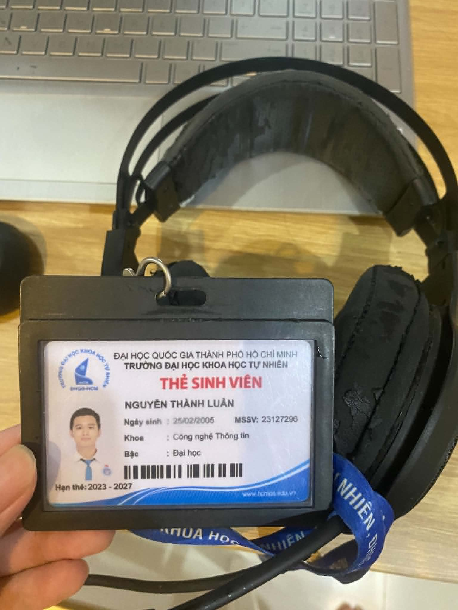

### 2. Bảng test cases
- **Tổng số test case:** 15
- **Số test case được thực hiện:** 5 test case 
- **Xem nội dung chi tiết các test case tại file sau:** [Chi tiết test case](test_case/rapoo_vh520c_test_cases.xlsx)
- **Số test case AI đã tạo:** 10 
- **Số test case AI không tạo:** 5
- **Ảnh chụp các test case AI đã tạo:**
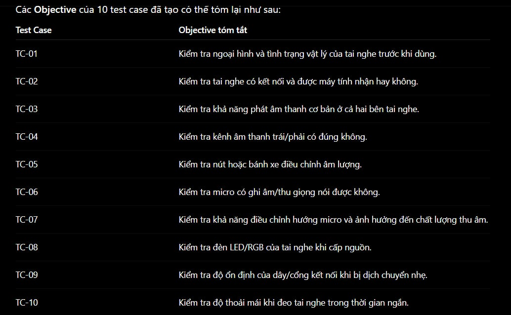
- **Lý do AI không thể tạo một số edge test case:** đầu tiên là do AI thiếu trải nghiệm thực tế, có một lỗi là dây chẻ nhánh quá ngắn nên không thể vừa ghim dây đèn và tai nghe, điều này chỉ có người dùng trải nghiệm mới phát hiện được. Thứ hai là AI bị giới hạn bởi dữ liệu dùng để train, có nghĩa là mô hình sẽ tạo test case từ những pattern có sẵn do đó không thể tạo ra test case với hành vi vô lý như của con người (chẳng hạn nhúng tai nghe vào nước hay đem đốt).
### 3.Link các video test execution (Youtube):
- TC-01: Kiểm tra tình trạng vật lý tai nghe (https://youtube.com/shorts/SAaBfRVrx1U?feature=share)
- TC-02: Kiểm tra khả năng kết nối máy tính của tai nghe (https://youtube.com/shorts/evg57BHlFAk?feature=share)
- TC-05: Kiểm tra nút điều chỉnh âm lượng (https://youtube.com/shorts/K8q_6F-e8Js?feature=share)
- TC-10: Kiểm tra độ thoải mái khi đeo tai nghe trong thời gian ngắn (https://youtube.com/shorts/eQclzmQN6HM?feature=share)
- TC-11: Kiểm tra độ dài nhánh chẻ dây phù hợp vị trí các cổng của Laptop (https://youtube.com/shorts/wO7onPzsTok?feature=share)
---

## Phần 4: QA/QC role mindmap

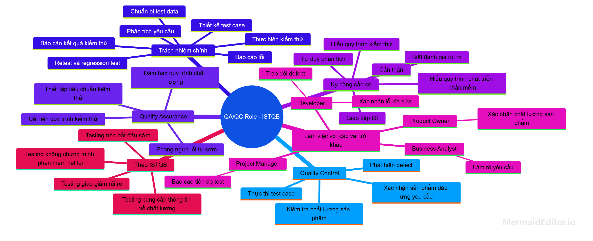

- Các điểm sai trong mindmap trên: 
  - Phần Trách nhiệm chính được gộp chung cho cả QA/QC là không hợp lý, đối với QA thì sẽ không nên có các trách nhiệm như chuẩn bị test data, thiết kế test case.
  - Mục Làm việc với các vai trò khác chưa hợp lý vì đang bị nhập nhằng giữa trách nhiệm các vai trò đó và Tester. Ví dụ nhánh Business Analyst -> Làm rõ yêu cầu, không rõ việc "Làm rõ yêu cầu" là trách nhiệm Tester hay Business Analyst.
  - Mục Quality Control có "Xác nhận sản phẩm đáp ứng yêu cầu", đây là việc của Product Owner hoặc khách hàng ở giai đoạn Acceptance Testing. Quality Control chỉ có trách nhiệm đảm bảo, cung cấp dữ liệu và báo cáo lỗi.